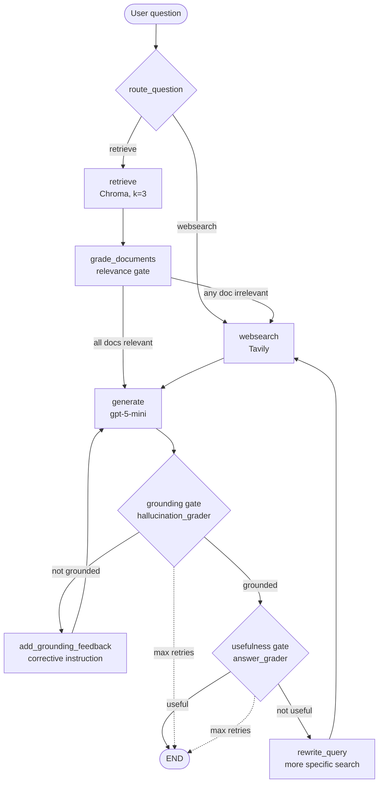

# Agentic RAG Assistant

**A self-correcting, enterprise-style document Q&A assistant built with LangGraph (CRAG pattern).**

## Overview

This project implements an internal-document Q&A assistant as an **agentic RAG workflow**: instead of a single retrieve-then-generate pass, the system routes each question to the best data source, grades the relevance of every retrieved document, checks each generated answer for hallucinations and usefulness, and automatically falls back to web search or regenerates when a quality gate fails. The graph is a LangGraph `StateGraph` with explicit conditional edges, a bounded retry loop, and three independent LLM quality gates — a practical implementation of the **Corrective RAG (CRAG)** pattern.

## Key Features

- **Question routing** — an LLM router sends knowledge-base questions to vector retrieval and out-of-scope questions straight to web search.
- **Three quality gates**, each an independent structured-output LLM grader:
  1. **Document relevance** — irrelevant retrieved chunks are filtered out before generation, and external web results must pass the *same* relevance gate before they're added to the context (untrusted sources don't get a free pass).
  2. **Answer grounding (anti-hallucination)** — answers not supported by the documents are regenerated.
  3. **Answer usefulness** — grounded but off-target answers trigger a web-search supplement.
- **Web search fallback** via Tavily when the local knowledge base isn't sufficient.
- **Privacy mode** — a `WEB_SEARCH_ENABLED=false` toggle disables every web-search path (routing, fallback, and supplement), so user questions never leave the local environment.
- **Bounded self-correction with honest failure reporting** — a `retries` counter in graph state caps the regenerate/web-search loop (`MAX_RETRIES = 5`), the final allowed generation is still fully graded before the protective stop, and if it still fails a gate the answer is delivered with an explicit warning instead of being presented as successful.
- **Meaningful retries** — each retry changes the input instead of replaying it at `temperature=0`: a failed grounding check injects a corrective instruction into the next generation, and a failed usefulness check rewrites the web-search query (with the fresh web supplement *replacing* the stale one, not stacking duplicates).
- **Per-run cost budget** — counted LLM calls, web searches, and web-result grades are tracked in state and capped by env-configurable budgets; an exhausted budget stops the run safely with an explicit caveat instead of spending indefinitely.
- **Graceful degradation on external failures** — a failing dependency (Chroma retriever, Tavily, the generation LLM, any grader, the query rewriter) never crashes the graph: the run degrades (web fallback, local-only answer, original-question search) or stops safely, records a machine-readable `stop_reason`, and the CLI appends an honest caveat. Ungraded content is never trusted, and an answer whose verification failed is never presented as verified.
- **Side-effect-free imports** — every external client (`ChatOpenAI`, `OpenAIEmbeddings`, `Chroma`, Tavily) is built inside a lazy `@lru_cache` factory. Importing any module requires no API keys and no network, which makes the whole graph unit-testable with plain `monkeypatch`.
- **Two-tier test suite** — fully mocked node tests that run with zero API keys, plus clearly separated integration tests against the real model.

## Architecture



### LangGraph workflow, step by step

1. **`route_question`** (conditional entry point) — a structured-output router (`datasource: "retrieve" | "websearch"`) decides whether the question is covered by the ingested knowledge base or needs external/current information.
2. **`retrieve`** — top-3 similarity search against a persisted Chroma vector store.
3. **`grade_documents`** — each chunk is graded individually (`is_relevant: bool`); irrelevant chunks are dropped, and if any chunk failed, a `web_search` flag routes the flow through Tavily before generating.
4. **`websearch`** — searches with the rewritten `search_query` on retry rounds (original question otherwise). Each Tavily result is individually graded for relevance against the *original* question (reusing the retrieval grader, so external content faces the same gate as internal chunks); only relevant results are merged into a single `Document` (tagged `source: web_search`), which **replaces** any previous web supplement instead of stacking duplicates. Malformed responses and irrelevant results are dropped defensively — if nothing usable comes back, the workflow continues with the existing documents.
5. **`generate`** — answers strictly from the provided context; with an empty context it returns a deterministic "not enough information" response without calling the LLM. Each pass increments `retries`.
6. **`grade_generation`** (conditional edge) — two-layer check with eight explicit outcomes:
   - `not_grounded` → `add_grounding_feedback` injects a corrective instruction into the next generation, then regenerate,
   - `useful` → END,
   - `not_useful` → `rewrite_query` produces a more specific search query, then web search and regenerate,
   - `web_search_disabled` → terminal notice node (privacy mode; see below),
   - `max_retries_not_grounded` / `max_retries_not_useful` → terminal notice nodes recording which quality gate the final answer failed (the limit is checked *after* grading, so even the last generation gets a full quality check, and a failed answer is never presented as a normal one),
   - `generation_error` → the generation LLM call itself failed; the run ends immediately with a safe placeholder answer, never graded,
   - `tool_error` → a grader call failed; the run ends through a terminal notice node with the answer explicitly flagged as unverified.

State is a minimal `TypedDict` (`question`, `documents`, `generation`, `web_search`, `retries`) defined in `graph/state.py`.

## Tech Stack

| Layer | Technology |
|---|---|
| Orchestration | LangGraph (`StateGraph`, conditional edges) |
| LLM | OpenAI `gpt-5-mini` (router, graders, generation — all structured output via Pydantic) |
| Embeddings | `OpenAIEmbeddings` |
| Vector store | Chroma (local persistence) |
| Web search | Tavily |
| Chains | LangChain LCEL |
| Package management | uv (`pyproject.toml` + committed `uv.lock`) |
| Testing | pytest (mocked unit tests + key-gated integration tests) |

## Project Structure

```
.
├── main.py                  # CLI entry point: interactive Q&A loop over the compiled graph
├── ingestion.py             # One-time KB build: load URLs → split → embed → persist to Chroma
├── structure.md             # Prose description of the workflow design
├── graph/
│   ├── graph.py             # StateGraph assembly, routing/decision functions, MAX_RETRIES, compiled `app`
│   ├── state.py             # GraphState TypedDict
│   ├── config.py            # Env-driven runtime flags (WEB_SEARCH_ENABLED)
│   ├── consts.py            # Node-name constants
│   ├── nodes/               # retrieve, grade_documents, generate, web_search,
│   │                        #   retry helpers (add_grounding_feedback, rewrite_query),
│   │                        #   terminal notice nodes (stop_reason recorders)
│   └── chains/              # LCEL chains: generation, retrieval_grader, question_router,
│                            #   hallucination_grader, answer_grader, query_rewriter
│                            #   (each behind a lazy get_*() factory)
└── tests/
    ├── conftest.py          # Loads .env; provides the `requires_openai` skip marker
    ├── node/                # Unit tests — all external dependencies mocked, no API keys needed
    ├── graph/               # Routing / privacy-toggle / compiled-graph tests — fully mocked
    └── chains/              # Integration tests — call the real gpt-5-mini, need OPENAI_API_KEY
```

## Setup

Requires **Python ≥ 3.11** and [uv](https://docs.astral.sh/uv/).

```powershell
# 1. Clone and enter the project
git clone <repo-url>
cd Agentic_RAG_Claude

# 2. Install dependencies (creates .venv from the committed uv.lock)
uv sync --group dev

# 3. Configure environment variables
Copy-Item .env.example .env   # then edit .env and add your keys
```

### Environment variables

See [`.env.example`](.env.example) for the full template:

| Variable | Required | Used for |
|---|---|---|
| `OPENAI_API_KEY` | Yes | Chat models (router, graders, generation) and embeddings |
| `TAVILY_API_KEY` | Yes | Web-search fallback node |
| `WEB_SEARCH_ENABLED` | Optional (default `true`) | Set to `false` to disable all external web search (privacy mode) |
| `MAX_LLM_CALLS_PER_RUN`, `MAX_WEB_SEARCHES_PER_RUN`, `MAX_WEB_RESULTS_TO_GRADE` | Optional (defaults `30` / `5` / `15`) | Per-run cost/latency budgets (see below) |
| `LANGCHAIN_TRACING_V2`, `LANGCHAIN_API_KEY`, `LANGCHAIN_PROJECT` | Optional | LangSmith tracing of the correction loops |
| `USER_AGENT` | Optional | Polite user agent for ingestion's web loader |

`.env` is gitignored; only `.env.example` is committed.

### Privacy mode (`WEB_SEARCH_ENABLED=false`)

In enterprise or compliance-sensitive deployments, sending user questions to an
external search API is a data-leak risk: every routed or fallback web search
transmits the question text to a third-party service. Setting
`WEB_SEARCH_ENABLED=false` guarantees questions never leave the local environment:

- The entry router never sends a question to web search — everything goes to vector retrieval (the router LLM call is skipped entirely on this path).
- If retrieved documents are graded irrelevant, the workflow generates from whatever relevant documents remain instead of searching the web; with none left, it returns the deterministic *"I do not have enough information in the provided documents."* answer rather than fabricating one.
- A grounded-but-off-target answer ends the run with the grounded answer instead of triggering a web-search supplement. In that case the workflow records a `stop_reason` in its state, and the CLI appends an explicit caveat to the answer so the limitation is never silent:

  > *Note: Web search is disabled, so I could only use the local knowledge base. I may not have enough information to fully answer this question.*

  The caveat appears **only** when web search is disabled *and* the workflow would otherwise have needed it — successful local answers are printed without any warning, in both modes.

All grounding and usefulness quality gates remain active in privacy mode. The
default (variable unset or any value other than `false`/`0`/`no`/`off`) preserves
the full web-search behavior.

### Retry-exhaustion warnings

The self-correction loop is capped at `MAX_RETRIES = 5` generations. The limit is
checked *after* grading, so even the final generation gets a full quality check —
and if it still fails, the workflow records which gate failed in `stop_reason`
and the CLI appends an explicit warning instead of presenting the answer as
successful:

- **Still not grounded** (`max_retries_not_grounded`):

  > *Warning: This answer did not pass the grounding (anti-hallucination) check after the retry limit was reached. It may contain information that is not supported by the source documents, so do not treat it as fully reliable.*

- **Grounded but still not useful** (`max_retries_not_useful`):

  > *Warning: This answer did not pass the usefulness check after the retry limit was reached. It is grounded in the source documents but may not fully answer your question.*

Answers that pass both gates are printed without any warning, exactly as before.

### Per-run cost / latency budget

Each graph run tracks its spend in state: `llm_call_count` (generations, query
rewrites, web-result grading calls), `web_search_count` (Tavily searches), and
`web_result_grading_count`. Three env-configurable budgets cap them:

- `MAX_LLM_CALLS_PER_RUN` (default 30) — checked *before* each post-generation
  grading round; once spent, the run stops immediately through a
  `budget_exhausted` stop reason rather than spending more.
- `MAX_WEB_SEARCHES_PER_RUN` (default 5) — a spent search budget stops the
  "not useful" retry loop (looping toward a search that can't run is waste)
  and defensively skips any search the node is still asked to perform.
- `MAX_WEB_RESULTS_TO_GRADE` (default 15) — once spent, remaining web results
  are dropped *ungraded and unused* (conservative: unvetted content never
  reaches generation); the run itself continues.

When a budget ends the run, the CLI appends:

> *Note: This answer stopped because the per-run cost/latency budget was reached. The answer may be incomplete or not fully verified.*

The defaults are deliberately sized above the worst case the `MAX_RETRIES`
loop can produce, so default behavior is unchanged — the budgets exist as a
hard cost backstop and for tightening in cost-sensitive deployments.
(Hallucination/answer-grader calls are not individually counted: they are
bounded at two per generation, so capping counted calls transitively caps
them.)

### External dependency failure handling

A failing external dependency never crashes the graph. Each failure is caught
at its call site, logged by category only (exception type, never messages that
could carry secrets), recorded as a `stop_reason`, and surfaced to the user as
a caveat appended by the CLI:

| Failure | Behavior | `stop_reason` |
|---|---|---|
| Chroma retriever | Degrade to web-search fallback (or the deterministic insufficient-context answer in privacy mode) | `retrieval_error` |
| Tavily search | Continue with local documents only; the failed attempt still counts against the web-search budget | `web_search_error` |
| Generation LLM | Stop immediately with a safe placeholder answer — the failed generation is never graded or presented as normal | `generation_error` |
| Query rewriter | Fall back to searching with the original question; the retry loop continues fully gated | `tool_error` |
| Relevance grader (local chunk or web result) | Drop the ungraded content — unvetted content never reaches generation; the rest continues | `tool_error` |
| Hallucination / answer grader | Stop and deliver the answer explicitly flagged as unverified | `tool_error` |

Degraded runs keep their `stop_reason` to the end, so even an answer that
later passes every gate carries an honest note about what failed along the
way. All privacy-mode guarantees, budgets, and retry limits remain in force
on every failure path.

## Build the knowledge base (ingestion)

Run once before first use (and again whenever the source URLs change):

```powershell
uv run python ingestion.py
```

This loads the configured URLs, splits them into 1000-character chunks (200 overlap), embeds them, and persists a Chroma collection to `chroma_db/` (gitignored). The demo corpus is three LangChain documentation pages (RAG, vector stores, text splitters) — swap the `URLS` list in `ingestion.py` for your own internal documents.

## Run the assistant

```powershell
uv run python main.py
```

```
Enterprise Knowledge Assistant
Type 'exit' to quit.

Enter your question:
> Why do we split documents into chunks?
```

Node-by-node progress banners (`---RETRIEVE---`, `---CHECK HALLUCINATIONS---`, …) show the graph's path, including any correction loops.

## Run the tests

```powershell
# Unit tests — fully mocked, NO API keys required
uv run pytest tests/node/ -v

# Graph routing / privacy-toggle tests — fully mocked, NO API keys required
uv run pytest tests/graph/ -v

# Integration tests — call the real gpt-5-mini, require OPENAI_API_KEY (skipped if unset)
uv run pytest tests/chains/ -v

# Whole suite
uv run pytest -v
```

### Mocked unit tests vs. API-based chain tests

| | `tests/node/` + `tests/graph/` (unit) | `tests/chains/` (integration) |
|---|---|---|
| What is tested | Node functions (state in/out), routing decisions, and the compiled graph with mocked chains | The LCEL chains: real prompts + structured output against the live model |
| External calls | **None** — retriever, graders, Tavily, and the generation seam are monkeypatched at their lazy `get_*()` factories | Real OpenAI API calls |
| Requirements | No API keys | `OPENAI_API_KEY` (tests are skipped, not failed, without it via the `requires_openai` marker) |
| Speed / cost | Seconds, free | ~1 minute, small API cost |
| Status | 105 tests passing (33 node + 72 graph) | 37 tests passing |

This split is enabled by the lazy-factory pattern: because no client is constructed at import time, every external dependency has a clean, patchable seam.

## Current Limitations

- **Single-turn CLI** — no conversation memory; each question is independent. No API/web surface.
- **Observability is `print()`-based** — no structured logging, timing, or token/cost tracking out of the box (LangSmith tracing can be enabled via env vars).
- **Aggressive web fallback** — a single irrelevant retrieved chunk triggers a web-search detour, even when relevant chunks remain.
- **Non-idempotent ingestion** — re-running `ingestion.py` appends duplicate chunks to the existing Chroma collection.
- **Per-document sequential grading** — relevance grading makes one LLM call per chunk.
- Web search and document loading still use the sunset `langchain-community` integrations.

## Future Improvements

- Structured logging and documented LangSmith tracing setup.
- A small offline evaluation harness (golden Q&A set scored with the existing graders).
- Idempotent ingestion with stable document IDs; batched relevance grading.
- CI (GitHub Actions) running the mocked unit suite on every push.
- Migration from `langchain-community` to the maintained standalone integrations (e.g. `langchain-tavily`).

## What This Project Demonstrates

For reviewers and hiring managers, this codebase is intended to show:

- **Agentic workflow design beyond toy RAG** — a real CRAG implementation with conditional routing, multi-gate self-correction, and a deliberately bounded retry loop (including the subtle decision to grade the final generation *before* enforcing the cap).
- **Dependency-injection discipline in an LLM codebase** — every external client lives behind a lazy cached factory, keeping imports side-effect-free and making the entire graph testable without keys, network, or cost.
- **A deliberate testing strategy** — fast, deterministic, fully mocked unit tests for orchestration logic, strictly separated from clearly labeled, key-gated integration tests for prompt/model behavior.
- **Structured LLM outputs as control flow** — Pydantic schemas (`RouteQuery`, `RetrievalGrade`, `GradeHallucination`, `GradeAnswer`) turn model judgments into typed booleans that drive graph edges, rather than parsing free text.
- **Honest scoping** — the limitations above are documented on purpose: the project optimizes for demonstrating the correction-loop architecture clearly, not for pretending to be production infrastructure.
