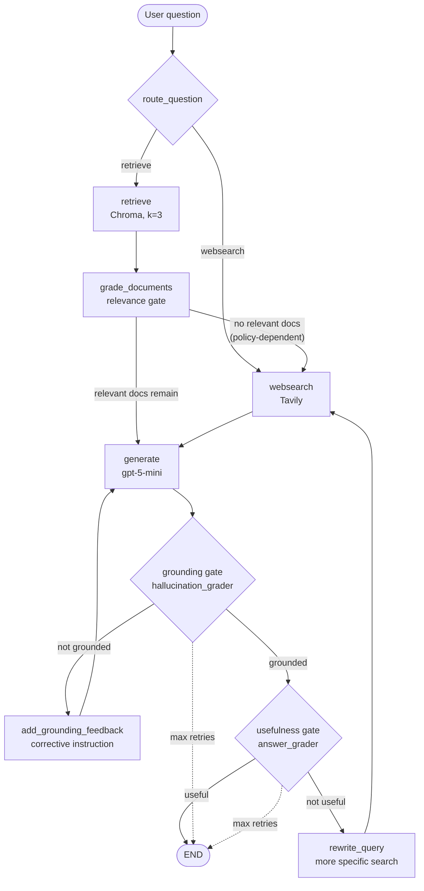

# Enterprise RAG — Enterprise Document Q&A Engine (企业文档问答引擎)

[](https://github.com/rhenus-Q/Enterprise-Office-Agent/actions/workflows/ci.yml)

**A self-correcting, enterprise-style document Q&A engine built with LangGraph (CRAG pattern).**

> This is the `enterprise_rag` module of the [Enterprise Office Agent](../README.md)
> repository — the completed Enterprise Document Q&A / Agentic RAG engine and the
> subject of this document. It sits alongside an implemented companion module,
> [`office_agent/`](../office_agent/), a deterministic keyword-routed Office Agent
> over seven office capabilities. Most Office Agent capabilities run on local mock
> data with no LLM; its **Knowledge Q&A** capability is a thin adapter over this
> `enterprise_rag` engine, and its **Email Digest** and **Daily Briefing narrative**
> are optional, default-off LLM assists. See the
> [repo-level README](../README.md) for the big picture, the
> [Office Agent demo doc](../office_agent/README.md) for that module's
> behavior, and [structure.md](../structure.md) for the architecture deep-dive.

## Overview

This project implements an internal-document Q&A assistant as an **agentic RAG workflow**: instead of a single retrieve-then-generate pass, the system routes each question to the best data source, grades the relevance of every retrieved document, checks each generated answer for hallucinations and usefulness, and automatically falls back to web search or regenerates when a quality gate fails. The graph is a LangGraph `StateGraph` with explicit conditional edges, a bounded retry loop, and three independent LLM quality gates — a practical implementation of the **Corrective RAG (CRAG)** pattern.

The knowledge base is a **synthetic enterprise corpus**: six fictional AcmeCorp internal documents (VPN access policy, expense reimbursement policy, security incident response playbook, on-call & escalation policy, data retention policy, employee onboarding guide) under [`enterprise_rag/data/acmecorp_internal_docs/`](../enterprise_rag/data/acmecorp_internal_docs/). The documents are entirely fictional — no real company data — but written with realistic structure (effective dates, owners, thresholds, SLAs, escalation paths, exceptions), so privacy mode, provenance, and the quality gates operate on enterprise-shaped content rather than tutorial pages.

## Key Features

* **Question routing** — an LLM router sends knowledge-base questions to vector retrieval and out-of-scope questions straight to web search.
* **Three quality gates**, each an independent structured-output LLM grader:

  1. **Document relevance** — irrelevant retrieved chunks are filtered out before generation, and external web results must pass the *same* relevance gate before they're added to the context (untrusted sources don't get a free pass).
  2. **Answer grounding (anti-hallucination)** — answers not supported by the documents are regenerated.
  3. **Answer usefulness** — grounded but off-target answers trigger a web-search supplement.
* **Web search fallback** via Tavily when the local knowledge base isn't sufficient.
* **Privacy mode** — a `WEB_SEARCH_ENABLED=false` toggle disables every web-search path (routing, fallback, and supplement), so user questions never leave the local environment.
* **Bounded self-correction with honest failure reporting** — a `retries` counter in graph state caps the regenerate/web-search loop (`MAX_RETRIES = 5`), the final allowed generation is still fully graded before the protective stop, and if it still fails a gate the answer is delivered with an explicit warning instead of being presented as successful.
* **Meaningful retries** — each retry changes the input instead of replaying it at `temperature=0`: a failed grounding check injects a corrective instruction into the next generation, and a failed usefulness check rewrites the web-search query (with the fresh web supplement *replacing* the stale one, not stacking duplicates).
* **Per-run cost budget** — counted LLM calls, web searches, and web-result grades are tracked in state and capped by env-configurable budgets; an exhausted budget stops the run safely with an explicit caveat instead of spending indefinitely.
* **Graceful degradation on external failures** — a failing dependency (Chroma retriever, Tavily, the generation LLM, any grader, the query rewriter) never crashes the graph: the run degrades (web fallback, local-only answer, original-question search) or stops safely, records a machine-readable `stop_reason`, and the CLI appends an honest caveat. Ungraded content is never trusted, and an answer whose verification failed is never presented as verified.
* **Answer provenance** — every answer built from documents ends with a deterministic `Sources:` section distinguishing local corpus documents (by title or URL) from the web-search supplement. Web provenance is **page-level**: each relevant result's title and URL are preserved and cited (`Web search: <title> — <url>`), falling back to the query-level citation when Tavily returns no URLs. Formatting is metadata-only after the graph finishes — no LLM-generated citations, no prompt changes, no document content exposed.
* **Side-effect-free imports** — every external client (`ChatOpenAI`, `OpenAIEmbeddings`, `Chroma`, Tavily) is built inside a lazy `@lru_cache` factory. Importing any module requires no API keys and no network, which makes the whole graph unit-testable with plain `monkeypatch`.
* **Two-tier test suite** — fully mocked node tests that run with zero API keys, plus clearly separated integration tests against the real model.

## Architecture



### LangGraph workflow, step by step

1. **`route_question`** (conditional entry point) — a structured-output router (`datasource: "retrieve" | "websearch"`) decides whether the question is covered by the ingested knowledge base or needs external/current information.
2. **`retrieve`** — top-3 similarity search against a persisted Chroma vector store.
3. **`grade_documents`** — each chunk is graded individually (`is_relevant: bool`); irrelevant chunks are dropped, and any failure sets a `web_search` flag. What happens next is governed by `WEB_FALLBACK_POLICY` (see below): by default (**conservative**) the flow generates from the remaining relevant chunks and only detours through Tavily when *no* relevant chunk survives; `aggressive` restores the legacy any-irrelevant-chunk-triggers-web behavior; `disabled` keeps local retrieval paths local entirely.
4. **`websearch`** — searches with the rewritten `search_query` on retry rounds (original question otherwise). Each Tavily result is individually graded for relevance against the *original* question (reusing the retrieval grader, so external content faces the same gate as internal chunks); only relevant results are merged into a single `Document` (tagged `source: web_search`, with each contributing page's title/URL kept in `web_sources` metadata for the Sources section), which **replaces** any previous web supplement instead of stacking duplicates. Malformed responses and irrelevant results are dropped defensively — if nothing usable comes back, the workflow continues with the existing documents.
5. **`generate`** — answers strictly from the provided context; with an empty context it returns a deterministic "not enough information" response without calling the LLM and flags it via `insufficient_context` in state. Each pass increments `retries`.
6. **`grade_generation`** (conditional edge) — two-layer check with eleven explicit outcomes:

   * `insufficient_context` → the generation is the deterministic insufficient-context answer (no usable documents); both graders are skipped — there is nothing to verify and regenerating from the same empty context cannot help — and the run ends honestly on the first pass (in privacy mode via the `web_search_disabled` notice, so the caveat explains why no information could be added),
   * `not_grounded` → `add_grounding_feedback` injects a corrective instruction into the next generation, then regenerate,
   * `useful` → END,
   * `not_useful` → `rewrite_query` produces a more specific search query, then web search and regenerate,
   * `web_search_disabled` → terminal notice node (privacy mode; see below),
   * `web_fallback_disabled` → terminal notice node (`WEB_FALLBACK_POLICY=disabled` blocked a local-only run's not-useful web retry; see below),
   * `max_retries_not_grounded` / `max_retries_not_useful` → terminal notice nodes recording which quality gate the final answer failed (the limit is checked *after* grading, so even the last generation gets a full quality check, and a failed answer is never presented as a normal one),
   * `budget_exhausted` → the per-run cost budget is spent; terminal notice node, the answer goes out with an explicit caveat,
   * `generation_error` → the generation LLM call itself failed; the run ends immediately with a safe placeholder answer, never graded,
   * `tool_error` → a grader call failed; the run ends through a terminal notice node with the answer explicitly flagged as unverified.

State is a `TypedDict` defined in `enterprise_rag/graph/state.py` with fourteen fields: the working data (`question`, `documents`, `generation`), control flags (`web_search`, `web_search_enabled`, `web_fallback_policy`, `insufficient_context`), the retry machinery (`retries`, `stop_reason`, `retry_feedback`, `search_query`), and the per-run budget counters (`llm_call_count`, `web_search_count`, `web_result_grading_count`). See [structure.md](../structure.md) §3 for the full field-by-field table.

## Tech Stack

| Layer              | Technology                                                                             |
| ------------------ | -------------------------------------------------------------------------------------- |
| Orchestration      | LangGraph (`StateGraph`, conditional edges)                                            |
| LLM                | OpenAI `gpt-5-mini` (router, graders, generation — all structured output via Pydantic) |
| Embeddings         | `OpenAIEmbeddings`                                                                     |
| Vector store       | Chroma (local persistence)                                                             |
| Web search         | Tavily (`tavily-python` SDK)                                                            |
| Chains             | LangChain LCEL                                                                         |
| Package management | uv (`pyproject.toml` + committed `uv.lock`)                                            |
| Testing            | pytest (mocked unit tests + key-gated integration tests)                               |

## Module Structure

The `enterprise_rag` package holds the whole RAG engine. The standalone RAG CLI
(`enterprise_rag/cli.py`, run via `uv run python -m enterprise_rag.cli`), the RAG test suites (`tests/enterprise_rag/nodes/`, `tests/enterprise_rag/graph/`,
`tests/enterprise_rag/evals/`, `tests/enterprise_rag/chains/`), the Enterprise RAG behavioral eval
harness (`evals/enterprise_rag/run_eval.py`
+ `evals/enterprise_rag/questions.jsonl`), and the Architecture Decision Records (`docs/adr/`)
live at the **repo root** and target this module. The repo root also holds the
Office Agent's own tests (`tests/office_agent/`, including the gated
`tests/office_agent/integration/`) and
assist evals (`evals/office_agent/llm_assist/`), which target `office_agent/` instead — see
the [repo-level README](../README.md) for the full repository layout.

```
enterprise_rag/                  # Enterprise Document Q&A Engine (企业文档问答引擎)
├── ingestion.py                 # KB build: load local Markdown corpus → split → embed → persist to Chroma (idempotent)
├── data/
│   └── acmecorp_internal_docs/  # Synthetic AcmeCorp corpus: 6 fictional internal policy/guide documents
└── graph/
    ├── graph.py                 # StateGraph assembly, routing/decision functions, MAX_RETRIES, compiled `app`
    ├── engine.py                # Canonical engine API: answer_question(), AnswerOptions/AnswerResult, seed_state(),
    │                            #   lightweight observability (run_id, node path, timings, optional trace JSON)
    ├── formatting.py            # Shared presentation: stop-reason caveats + deterministic Sources section
    ├── state.py                 # GraphState TypedDict
    ├── config.py                # Env-driven runtime flags: WEB_SEARCH_ENABLED, WEB_FALLBACK_POLICY,
    │                            #   per-run budgets (MAX_LLM_CALLS_PER_RUN, MAX_WEB_SEARCHES_PER_RUN, MAX_WEB_RESULTS_TO_GRADE)
    ├── consts.py                # Node-name constants and stop_reason values
    ├── nodes/                   # retrieve, grade_documents, generate, web_search,
    │                            #   retry helpers (add_grounding_feedback, rewrite_query),
    │                            #   terminal notice nodes (stop_reason recorders)
    └── chains/                  # LCEL chains: generation, retrieval_grader, question_router,
                                 #   hallucination_grader, answer_grader, query_rewriter
                                 #   (each behind a lazy get_*() factory)
```

The programmatic entry point is `enterprise_rag.graph.engine.answer_question()`;
`enterprise_rag/cli.py` is the standalone interactive CLI over it
(`uv run python -m enterprise_rag.cli`).

## Setup

Requires **Python ≥ 3.11** and [uv](https://docs.astral.sh/uv/).

```powershell
# 1. Clone and enter the project
git clone https://github.com/rhenus-Q/Enterprise-Office-Agent.git
cd Enterprise-Office-Agent

# 2. Install dependencies (creates .venv from the committed uv.lock)
uv sync --group dev

# 3. Configure environment variables
Copy-Item .env.example .env   # then edit .env and add your keys
```

### Environment variables

See [`.env.example`](../.env.example) for the full template:

| Variable                                                                            | Required                              | Used for                                                                                                                                                                       |
| ----------------------------------------------------------------------------------- | ------------------------------------- | ------------------------------------------------------------------------------------------------------------------------------------------------------------------------------ |
| `OPENAI_API_KEY`                                                                    | Yes                                   | Chat models (router, graders, generation) and embeddings                                                                                                                       |
| `TAVILY_API_KEY`                                                                    | Yes                                   | Web-search fallback node                                                                                                                                                       |
| `PRIVACY_MODE`                                                                      | Optional (default off)                | Disables Tavily web search, LangSmith tracing, and both optional Office LLM assists; preserves the OpenAI RAG path (see below)                                                  |
| `OFFLINE_MODE`                                                                      | Optional (default off)                | Everything `PRIVACY_MODE` disables, plus OpenAI and all other external services; Knowledge Q&A, ingestion, and real-model evals fail closed (see below)                          |
| `WEB_SEARCH_ENABLED`                                                                | Optional (default `true`)             | Set to `false` to disable all external web search (privacy mode)                                                                                                               |
| `WEB_FALLBACK_POLICY`                                                               | Optional (default `conservative`)     | `conservative` / `aggressive` / `disabled` — when document grading falls back to web search (see below)                                                                        |
| `MAX_LLM_CALLS_PER_RUN`, `MAX_WEB_SEARCHES_PER_RUN`, `MAX_WEB_RESULTS_TO_GRADE`     | Optional (defaults `30` / `5` / `15`) | Per-run cost/latency budgets (see below)                                                                                                                                       |
| `LANGCHAIN_TRACING_V2`, `LANGCHAIN_API_KEY`, `LANGCHAIN_PROJECT`                    | Optional                              | LangSmith tracing for LangChain/LangGraph runs. Set `LANGCHAIN_TRACING_V2=true`, provide a LangSmith API key, and choose a project name such as `enterprise-ai-automation-agent`. |

`.env` is gitignored; only `.env.example` is committed.

### Runtime privacy modes (`PRIVACY_MODE` / `OFFLINE_MODE`)

Two hierarchical, default-off switches sit above the per-service flags
([ADR 019](../docs/adr/019-hierarchical-runtime-privacy-modes.md)).
Both use strict truthy parsing (`true`/`1`/`yes`/`on`), and a mode can only
*restrict* — while active it overrides `WEB_SEARCH_ENABLED=true`,
`OFFICE_LLM_ENABLED=true`, the tracing variables, and any per-run
`AnswerOptions`. Precedence: `OFFLINE_MODE` > `PRIVACY_MODE` > individual flags.

* **`PRIVACY_MODE`** — nothing leaves the machine except the OpenAI calls the
  system needs. Disables Tavily web search, LangSmith tracing, and both optional
  Office LLM assists. Knowledge Q&A and ingestion work exactly as normal.
* **`OFFLINE_MODE`** — nothing leaves the machine at all. Adds OpenAI chat and
  embeddings to the above. It fails closed deterministically instead of
  attempting a call: `answer_question()` short-circuits **before the graph** and
  returns `stop_reason="offline_mode"` with an honest caveat; ingestion exits `2`
  before building a client; the real-model eval runners refuse with a
  `CONFIG ERROR`; `requires_openai` tests skip. Every `--validate-only` mode and
  all deterministic Office Agent capabilities keep working.

Note: running the full RAG eval under `PRIVACY_MODE` fails its web-dependent rows
by design — that is correct mode behavior, not a regression.

### Privacy mode (`WEB_SEARCH_ENABLED=false`)

In enterprise or compliance-sensitive deployments, sending user questions to an
external search API is a data-leak risk: every routed or fallback web search
transmits the question text to a third-party service. Setting
`WEB_SEARCH_ENABLED=false` guarantees questions never leave the local environment:

* The entry router never sends a question to web search — everything goes to vector retrieval (the router LLM call is skipped entirely on this path).
* If retrieved documents are graded irrelevant, the workflow generates from whatever relevant documents remain instead of searching the web; with none left, it returns the deterministic *"I do not have enough information in the provided documents."* answer rather than fabricating one.
* A grounded-but-off-target answer ends the run with the grounded answer instead of triggering a web-search supplement. In that case the workflow records a `stop_reason` in its state, and the CLI appends an explicit caveat to the answer so the limitation is never silent:

  > *Note: Web search is disabled, so I could only use the local knowledge base. I may not have enough information to fully answer this question.*

  The caveat appears **only** when web search is disabled *and* the workflow would otherwise have needed it — successful local answers are printed without any warning, in both modes.

All grounding and usefulness quality gates remain active in privacy mode, with
one principled exception in both modes: the deterministic insufficient-context
answer skips the graders entirely — it contains no claims to verify, and
regenerating from the same empty context cannot improve it. The default
(variable unset or any value other than `false`/`0`/`no`/`off`) preserves the
full web-search behavior.

### Web fallback policy (`WEB_FALLBACK_POLICY`)

Distinct from the privacy switch: `WEB_SEARCH_ENABLED=false` decides whether
external web search is allowed *at all* (and overrides everything below);
`WEB_FALLBACK_POLICY` decides *when* the system chooses retrieval-triggered
fallback while web search is otherwise allowed.

* **`conservative` (default)** — answer from the curated corpus first: if at
  least one relevant local document survives grading, generate from it; fall
  back to web search only when nothing relevant remains. A grounded local
  answer that later fails the usefulness gate can still trigger a rewritten
  web search.
* **`aggressive`** — legacy CRAG behavior: any irrelevant retrieved document
  triggers web fallback before generation. Better first-pass coverage for
  sparse corpora, at the cost of sending more questions to an external
  service.
* **`disabled`** — local retrieval paths never escalate to the web, including
  the post-generation not-useful retry on runs that have stayed local (those
  end with an explicit caveat via the `web_fallback_disabled` stop reason).
  Router-chosen web searches still work when web search is enabled. With no
  relevant local documents the assistant declines honestly instead of
  searching.

Invalid values fall back to `conservative`. The environment variable is the
*default* source only: the engine resolves the effective policy into per-run
graph state at run start, so callers (evals, tests, future automation) can
pass a different policy per run without touching the environment. Rationale
and trade-offs: [ADR 011](../docs/adr/enterprise_rag/011-web-fallback-policy.md).

### Programmatic engine API

The CLI, the eval harness, and tests all run questions through the same
entry point, `enterprise_rag.graph.engine.answer_question()` — state seeding and per-run
config resolution live in one place:

```python
from enterprise_rag.graph.engine import AnswerOptions, answer_question

result = answer_question(
    "How do I request VPN access?",
    AnswerOptions(web_search_enabled=True, web_fallback_policy="conservative"),
)
result.answer                  # raw generation
result.stop_reason             # "" = clean finish
result.sources                 # deduplicated citation lines
result.tracked_llm_calls       # budgeted operational counter (not total LLM usage)
result.web_fallback_policy     # the policy this run actually used
result.raw_state               # full final GraphState for internal callers
result.run_id                  # always set: preserved if provided, generated otherwise
result.node_path               # executed nodes in order, e.g. ["retrieve", "grade_documents", ...]
result.node_timings_ms         # one {"node", "duration_ms"} entry per step (approximate)
result.total_duration_ms       # wall-clock duration of the whole graph run
```

Options left as `None` fall back to the environment defaults
(`WEB_SEARCH_ENABLED` / `WEB_FALLBACK_POLICY`). The hard privacy guarantee is
unchanged: `web_search_enabled=False` — per run or via the environment —
means zero external web searches regardless of the fallback policy.

#### Run traces (optional, metadata-only)

Every run carries lightweight observability: a `run_id`, the executed node
path, per-step timings, and the total duration, collected centrally in the
engine by streaming the graph's node updates — no node or routing changes.
Pass `trace_path` to also write a trace JSON file:

```python
from enterprise_rag.graph.engine import AnswerOptions, answer_question

result = answer_question(
    "How do I request VPN access?",
    AnswerOptions(run_id="demo-1", trace_path="traces/demo-1.json"),
)
```

The trace contains `run_id`, `generated_at`, `question`, `node_path`,
`total_duration_ms`, `node_timings_ms`, `stop_reason`, the run counters
(`retries`, `tracked_llm_calls`, `web_search_count`,
`web_result_grading_count`), `web_search_enabled`, `web_fallback_policy`,
and the citation lines (`sources`). It deliberately **never** contains
document `page_content`, prompts, raw graph state, or API keys. By default
(`trace_path=None`) no file is written. Note that the question text itself
is part of the trace — store trace files accordingly.

#### LangSmith tracing (optional)

In addition to the engine's lightweight metadata-only trace JSON, LangSmith
tracing can be enabled through environment variables:

```env
LANGCHAIN_TRACING_V2=true
LANGCHAIN_API_KEY=your_langsmith_api_key
LANGCHAIN_PROJECT=enterprise-ai-automation-agent
```

The two tracing layers serve different purposes:

* **LangSmith tracing** captures detailed LangChain/LangGraph execution traces
  for debugging, including chain runs, prompts, model inputs/outputs, latency,
  token usage, and failures.
* **Engine trace JSON** is a small, CI-safe project artifact that records
  metadata only: `run_id`, node path, timings, counters, stop reason, policy
  flags, and source lines. It deliberately avoids document content, prompts,
  raw graph state, and API keys.

LangSmith is useful for development-time inspection; the engine trace is useful
for reproducible reports, eval artifacts, and lightweight debugging without
exposing internal content.

### Retry-exhaustion warnings

The self-correction loop is capped at `MAX_RETRIES = 5` generations. The limit is
checked *after* grading, so even the final generation gets a full quality check —
and if it still fails, the workflow records which gate failed in `stop_reason`
and the CLI appends an explicit warning instead of presenting the answer as
successful:

* **Still not grounded** (`max_retries_not_grounded`):

  > *Warning: This answer did not pass the grounding (anti-hallucination) check after the retry limit was reached. It may contain information that is not supported by the source documents, so do not treat it as fully reliable.*

* **Grounded but still not useful** (`max_retries_not_useful`):

  > *Warning: This answer did not pass the usefulness check after the retry limit was reached. It is grounded in the source documents but may not fully answer your question.*

Answers that pass both gates are printed without any warning, exactly as before.

### Per-run cost / latency budget

Each graph run tracks its spend in state: `llm_call_count` (generations, query
rewrites, web-result grading calls), `web_search_count` (Tavily searches), and
`web_result_grading_count`. Three env-configurable budgets cap them:

* `MAX_LLM_CALLS_PER_RUN` (default 30) — checked *before* each post-generation
  grading round; once spent, the run stops immediately through a
  `budget_exhausted` stop reason rather than spending more.
* `MAX_WEB_SEARCHES_PER_RUN` (default 5) — a spent search budget stops the
  "not useful" retry loop (looping toward a search that can't run is waste)
  and defensively skips any search the node is still asked to perform.
* `MAX_WEB_RESULTS_TO_GRADE` (default 15) — once spent, remaining web results
  are dropped *ungraded and unused* (conservative: unvetted content never
  reaches generation); the run itself continues.

When a budget ends the run, the CLI appends:

> *Note: This answer stopped because the per-run cost/latency budget was reached. The answer may be incomplete or not fully verified.*

The defaults are deliberately sized above the worst case the `MAX_RETRIES`
loop can produce, so default behavior is unchanged — the budgets exist as a
hard cost backstop and for tightening in cost-sensitive deployments.

**`llm_call_count` is a tracked operational counter, not total LLM usage.**
Router calls, local-chunk relevance grading, and the hallucination/answer
graders are not individually counted (the graders run inside a pure
conditional edge and are bounded at two per generation, so capping counted
calls transitively caps them). The counter therefore understates real API
usage by a bounded factor — fine for a budget backstop and relative
observability, **not** billing-accurate cost accounting. True cost accounting
would use tracing/token usage (e.g. LangSmith) rather than manual counters.

### External dependency failure handling

A failing external dependency never crashes the graph. Each failure is caught
at its call site, logged by category only (exception type, never messages that
could carry secrets), recorded as a `stop_reason`, and surfaced to the user as
a caveat appended by the CLI:

| Failure                                      | Behavior                                                                                                       | `stop_reason`      |
| -------------------------------------------- | -------------------------------------------------------------------------------------------------------------- | ------------------ |
| Chroma retriever                             | Degrade to web-search fallback (or the deterministic insufficient-context answer in privacy mode)              | `retrieval_error`  |
| Tavily search                                | Continue with local documents only; the failed attempt still counts against the web-search budget              | `web_search_error` |
| Generation LLM                               | Stop immediately with a safe placeholder answer — the failed generation is never graded or presented as normal | `generation_error` |
| Query rewriter                               | Fall back to searching with the original question; the retry loop continues fully gated                        | `tool_error`       |
| Relevance grader (local chunk or web result) | Drop the ungraded content — unvetted content never reaches generation; the rest continues                      | `tool_error`       |
| Hallucination / answer grader                | Stop and deliver the answer explicitly flagged as unverified                                                   | `tool_error`       |

Degraded runs keep their `stop_reason` to the end with one deliberate
exception: a *transient* `tool_error` (a dropped chunk/result or a failed
query rewrite — situations the run is built to recover from) is cleared when
the final answer subsequently passes **both** quality gates, so a fully
successful answer never ships with an error caveat. Whole-source degradations
(`retrieval_error`, `web_search_error`) persist even on success, and the
terminal `tool_error` (verification itself failed) is always kept. All
privacy-mode guarantees, budgets, and retry limits remain in force on every
failure path.

## Build the knowledge base (ingestion)

Run once before first use (and again whenever the corpus changes):

```powershell
uv run python -m enterprise_rag.ingestion
```

This loads the Markdown documents from `enterprise_rag/data/acmecorp_internal_docs/`, splits them into 1000-character chunks (200 overlap), embeds them, and persists a Chroma collection to `chroma_db/` (gitignored). Ingestion is **idempotent**: the existing collection is dropped and rebuilt with deterministic chunk ids, so re-running never duplicates chunks (tradeoff: a run that fails mid-ingestion leaves the index empty until re-run).

### The synthetic AcmeCorp corpus

The corpus is six fictional internal documents — created for this project, containing no real company data or copyrighted policies:

| Document                          | Category    | Sample question it answers                               |
| --------------------------------- | ----------- | -------------------------------------------------------- |
| `vpn_policy.md`                   | it_security | "How do I request VPN access?"                           |
| `expense_reimbursement_policy.md` | finance     | "What expenses require manager approval?"                |
| `incident_response_playbook.md`   | it_security | "When should a security incident be escalated to Sev-1?" |
| `on_call_escalation_policy.md`    | operations  | "Who gets paged for after-hours production incidents?"   |
| `data_retention_policy.md`        | compliance  | "How long are audit logs retained?"                      |
| `employee_onboarding_guide.md`    | hr          | "What should a new employee do during their first week?" |

Each document has an effective date, a policy owner, concrete rules (approval thresholds, ack SLAs, retention periods), escalation paths, an exceptions process, and contacts; documents cross-reference each other so multi-document questions retrieve coherently, with eval rows now checking multi-document provenance. Every document carries provenance metadata (`source`, `title`, `source_type: "local_corpus"`, `document_category`) that survives chunking and feeds the `Sources:` section. To use your own documents, drop Markdown files into the corpus folder (and optionally extend `DOCUMENT_CATEGORIES` in `enterprise_rag/ingestion.py`), then re-run ingestion.

## Run the assistant

```powershell
uv run python -m enterprise_rag.cli   # the standalone Enterprise RAG CLI
```

```
Agentic RAG Assistant for Enterprise Document Q&A
Type 'exit' to quit.

Enter your question:
> How do I request VPN access?
```

Node-by-node progress banners (`---RETRIEVE---`, `---CHECK HALLUCINATIONS---`, …) show the graph's path, including any correction loops.

### Source citations

Answers built from documents end with a `Sources:` section showing where the
context came from:

```
Answer:
Submit the "VPN Access Request" form in the IT Service Portal; your manager
approves it, and IT Security provisions access within 2 business days ...

Sources:
- Local corpus: AcmeCorp VPN Access Policy
- Web search: AcmeCorp VPN Client Setup Guide — https://example.com/vpn-setup
```

Local corpus documents are cited by their ingestion metadata (page title,
falling back to the source URL). The web supplement is cited **page-level**:
one line per relevant result, `<title> — <url>` (the bare URL when the title
is missing), deduplicated by URL. When Tavily returns no usable URLs the
citation falls back to the search query that produced the supplement
(`Web search: "<query>"`). Only results that passed the relevance gate are
cited — a dropped page is never named. Repeated sources are listed once,
missing metadata falls back to safe generic labels (`Local corpus document` /
`Web search result`), and runs that used no documents show no Sources section
at all. Citations are pure post-run formatting of `Document` metadata — the
LLM is not asked to generate them, so prompts and model behavior are
unchanged. When a run ends with a caveat, the caveat is printed *before* the
sources, so a sources list never implies a failed answer was verified.

## Run the tests

```powershell
# Unit tests — fully mocked, NO API keys required
uv run pytest tests/enterprise_rag/nodes/ -v

# Graph routing / privacy-toggle tests — fully mocked, NO API keys required
uv run pytest tests/enterprise_rag/graph/ -v

# Eval-harness helper tests — fully mocked, NO API keys required
uv run pytest tests/enterprise_rag/evals/ -v

# RAG chain integration tests — call the real gpt-5-mini, require OPENAI_API_KEY (skipped if unset)
uv run pytest tests/enterprise_rag/chains/ -v

# Whole suite
uv run pytest -v
```

The Office Agent has its own suites at the repo root — the fully mocked
`tests/office_agent/` (CI-safe) and the key-gated `tests/office_agent/integration/` (real
`gpt-5-mini` for the two LLM assists) — documented in the
[Office Agent demo doc](../office_agent/README.md), not here.

CI ([`.github/workflows/ci.yml`](../.github/workflows/ci.yml)) runs two parallel
jobs on every push and pull request — both keys-free:

* **`mocked-tests`**: the fully mocked suites (`tests/enterprise_rag/nodes/`,
  `tests/enterprise_rag/graph/`, `tests/enterprise_rag/evals/`, and the Office
  Agent's `tests/office_agent/` excluding its gated `integration/`), which also
  doubles as a regression test that imports stay side-effect-free.
* **`lint`**: `ruff check`, `ruff format --check`, and `mypy`. The mypy scope is
  the `[tool.mypy]` `files` list in `pyproject.toml`: the engine-API surface
  (`engine.py`, `config.py`, `formatting.py`, `state.py`, `consts.py`) plus the
  graph `nodes/` and `chains/` packages, plus the whole `office_agent/` package.

The key-gated integration suites (`tests/enterprise_rag/chains/`,
`tests/office_agent/integration/`) and
the full eval runs are deliberately excluded from CI.

## Dev hygiene

Ruff (lint + format), mypy (scoped), and pre-commit hooks are configured in
[`pyproject.toml`](../pyproject.toml) and [`.pre-commit-config.yaml`](../.pre-commit-config.yaml):

```powershell
# Install local hooks once per clone
uv run pre-commit install

# Lint and format (mirrors the CI lint job)
uv run ruff check .
uv run ruff format --check .
uv run mypy

# Apply safe fixes and format in one pass
uv run ruff check --fix . ; uv run ruff format .

# Run all hooks across every file (same tools as CI)
uv run pre-commit run --all-files
```

Mypy's scope is the `[tool.mypy]` `files` list in [`pyproject.toml`](../pyproject.toml):
the engine-API surface (`enterprise_rag/graph/engine.py`, `enterprise_rag/graph/config.py`,
`enterprise_rag/graph/formatting.py`, `enterprise_rag/graph/state.py`, `enterprise_rag/graph/consts.py`),
the graph `enterprise_rag/graph/nodes/` and `enterprise_rag/graph/chains/` packages, and the whole
`office_agent/` package. The graph-assembly module (`enterprise_rag/graph/graph.py`),
`enterprise_rag/ingestion.py`, and the tests stay outside scope (`graph.py` and
`ingestion.py` are followed silently when imported by in-scope modules). Mypy is
**not** a pre-commit hook (hook-venv isolation makes it unreliable for
LangChain-typed code); run it directly or via CI instead.

## Behavioral evals

Beyond code-path tests, the repo-root [`evals/`](../evals/) directory holds the
**Enterprise RAG behavioral eval** — `evals/enterprise_rag/run_eval.py` over
`evals/enterprise_rag/questions.jsonl`, writing `evals/enterprise_rag/results.md` — which exercises *this*
`enterprise_rag` graph. (A separate `evals/office_agent/llm_assist/` subdirectory evaluates
the Office Agent's optional Email Digest and Daily Briefing LLM assists; it is
not part of this engine's eval and is documented with the Office Agent.) The
Enterprise RAG eval is a lightweight behavioral harness: 24 realistic questions
([`evals/enterprise_rag/questions.jsonl`](../evals/enterprise_rag/questions.jsonl)) across six categories —
answerable from the AcmeCorp corpus (5), requiring web fallback (5),
unanswerable without fabricating (3), privacy-mode guarantees (2), multi-document provenance (4), and fallback-policy behavior (5). The
runner drives the real graph and applies **deterministic** checks (stop
reasons, source provenance including required local titles, run counters including web-search-count expectations, expected substrings, and effective fallback-policy echoes — no
LLM-as-judge), then writes a Markdown report to
[`evals/enterprise_rag/results.md`](../evals/enterprise_rag/results.md):

```powershell
# Validate the dataset format only — no API calls
uv run python evals/enterprise_rag/run_eval.py --validate-only

# Full eval — real OpenAI/Tavily calls, requires keys (not part of CI)
uv run python evals/enterprise_rag/run_eval.py
uv run python evals/enterprise_rag/run_eval.py --limit 3
```

The harness's pure helpers (loading, validation, checks, metrics, rendering)
are unit-tested without API calls in `tests/enterprise_rag/evals/`. See
[`evals/enterprise_rag/README.md`](../evals/enterprise_rag/README.md) for the
dataset schema and check rules.

## Architecture decision records

The major design decisions — `stop_reason` semantics, privacy mode,
meaningful retries, the web-result relevance gate, run budgets, graceful
degradation, deterministic provenance, the synthetic corpus, the eval
harness, the prompt-injection defense, and the web-fallback policy — are
documented as short ADRs in [`docs/adr/`](../docs/adr/), each
covering the context, the decision, its consequences, the trade-offs
accepted, and the alternatives deliberately not chosen. Start with the
[index](../docs/adr/README.md).

### Mocked unit tests vs. API-based chain tests

|                | `tests/enterprise_rag/nodes/` + `tests/enterprise_rag/graph/` + `tests/enterprise_rag/evals/` (unit)                                                                       | `tests/enterprise_rag/chains/` (integration)                                                                 |
| -------------- | ---------------------------------------------------------------------------------------------------------------------------- | --------------------------------------------------------------------------------------------- |
| What is tested | Node functions (state in/out), routing decisions, the compiled graph with mocked chains, and the eval harness's pure helpers | The LCEL chains: real prompts + structured output against the live model                      |
| External calls | **None** — retriever, graders, Tavily, and the generation seam are monkeypatched at their lazy `get_*()` factories           | Real OpenAI API calls                                                                         |
| Requirements   | No API keys                                                                                                                  | `OPENAI_API_KEY` (tests are skipped, not failed, without it via the `requires_openai` marker) |
| Speed / cost   | Seconds, free                                                                                                                | ~1 minute, small API cost                                                                     |
| CI             | Run keys-free on every push/PR (the `mocked-tests` job, alongside `tests/office_agent/`)                                     | Excluded from CI — needs a real key                                                           |

This split is enabled by the lazy-factory pattern: because no client is constructed at import time, every external dependency has a clean, patchable seam.

## Current Limitations

* **Single-turn CLI** — no conversation memory; each question is independent. No API/web surface.
* **Observability is split across two layers, but not yet production-grade** — LangSmith tracing is supported through environment variables, and the engine records lightweight per-run metadata (`run_id`, node path, timings, counters, stop reasons, and optional trace JSON). However, console logs are still `print()`-based, there is no structured logging or metrics backend, and the README does not yet include trace screenshots or saved LangSmith trace examples.
* **Per-document sequential grading** — relevance grading makes one LLM call per chunk/result, so latency and cost scale with the number of items graded.
* **Grounding feedback is coarse-grained** — failed grounding currently produces a fixed corrective instruction, not a rationale listing which claims were unsupported.
* **Prompt-injection defense is layered but still not a complete security boundary** — the trust boundary spans the whole pipeline: the generation prompt treats retrieved content, especially web results, as untrusted evidence, never as instructions ([ADR 010](../docs/adr/enterprise_rag/010-prompt-injection-defense.md)); the control-plane chains (router, both graders, query rewriter) carry explicit *Security rules* blocks so a payload embedded in the content they classify cannot steer the decision, and each document in the generation context is wrapped in explicit `[BEGIN/END UNTRUSTED DOCUMENT n]` delimiters ([ADR 012](../docs/adr/enterprise_rag/012-prompt-injection-hardening.md)). Deterministic, key-free graph-level tests pin the structural containment (privacy mode and `disabled` fallback can't be flipped by content, ungraded content never reaches generation, provenance stays metadata-only). These reduce risk but do not constitute a production security boundary: instruction and data still share one context window, so a sufficiently adversarial payload can still influence a real model's verdict or answer; the relevance gate checks topicality, not safety; and there is still no dedicated injection detector, content-sanitization layer, or domain allowlist. The mocked tests prove wiring-level containment, not live-model immunity. Generation has no tools to call, which limits — but does not eliminate — the impact of injected instructions.

## Future Improvements

* Structured logging and metrics-friendly observability.
* README/report evidence for LangSmith traces, such as screenshots or example trace links.
* Grader-scored (LLM-as-judge) eval metrics on top of the deterministic harness in `evals/`.
* Rationale-bearing grounding feedback that identifies unsupported claims.
* Batched relevance grading.

## Engineering Highlights

This project implements several engineering patterns for production-oriented LLM applications:

* **Agentic RAG workflow design** — a CRAG-style LangGraph workflow with conditional routing, document relevance grading, answer grounding checks, usefulness checks, and bounded self-correction loops.

* **Controlled dependency boundaries** — external clients such as OpenAI, Chroma, and Tavily are constructed behind lazy cached factories, keeping imports side-effect-free and making the graph testable without API keys, network access, or runtime cost.

* **Deterministic orchestration testing** — the orchestration layer is covered by fast, fully mocked unit tests, while prompt and model behavior are isolated in clearly labeled integration tests that require explicit API access.

* **Structured LLM outputs for control flow** — Pydantic schemas such as `RouteQuery`, `RetrievalGrade`, `GradeHallucination`, and `GradeAnswer` convert model judgments into typed routing decisions instead of relying on free-text parsing.

* **Explicit reliability boundaries** — privacy mode, retry limits, budget caps, graceful degradation, `stop_reason` values, and deterministic source formatting make failure modes visible instead of silently presenting unverified answers as successful.
