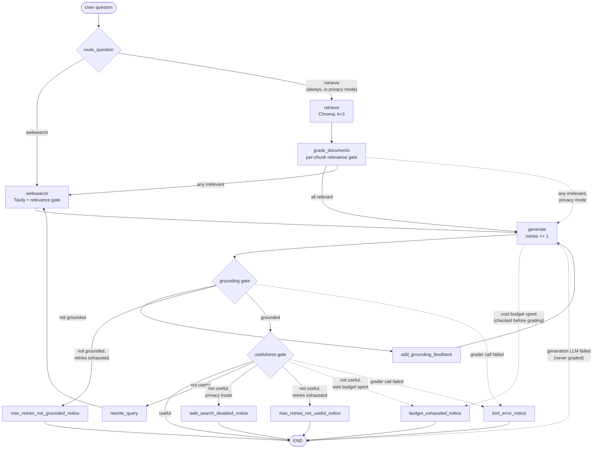

# Agentic RAG Architecture

This is the architecture deep-dive for the project. The [README](README.md)
covers setup and usage; this document describes the full workflow, state
machine, and design decisions, including the paths the README's simplified
diagram omits (terminal notice nodes and retry helpers).

## 1. Goal

An enterprise internal-document Q&A assistant that **never presents an
unvetted answer as a success**. Built as a self-correcting (CRAG-style)
LangGraph workflow:

- Answers come from a curated local knowledge base (Chroma) — a synthetic
  AcmeCorp internal-document corpus under `data/acmecorp_internal_docs/`
  (six fictional policy/guide documents; no real company data) — with web
  search (Tavily) as a fallback, and a privacy mode that disables web
  search entirely.
- Every answer passes explicit quality gates (document relevance, answer
  grounding, answer usefulness).
- Failed gates trigger **meaningful retries** that change the input between
  attempts, bounded by a retry budget.
- Runs that cannot end with a passing answer record a machine-readable
  `stop_reason`, and the CLI attaches an explicit user-facing caveat.
- External dependency failures (retriever, web search, generation LLM,
  graders, query rewriter) never crash the graph: they degrade or stop
  safely with their own `stop_reason` values (see §13).

## 2. High-level architecture

Three layers, all external clients behind lazy `@lru_cache` factories so every
module imports side-effect-free (no API keys, no network at import time):

| Layer | Location | Contents |
|---|---|---|
| Orchestration | `graph/graph.py` | `StateGraph` assembly, pure routing functions, `MAX_RETRIES = 5`, compiled `app` |
| Nodes | `graph/nodes/` | State-transforming steps; the only place state is written |
| Chains | `graph/chains/` | Six LCEL chains on `gpt-5-mini` (`temperature=0`): `question_router`, `retrieval_grader`, `generation`, `hallucination_grader`, `answer_grader`, `query_rewriter` |

Supporting modules: `graph/state.py` (the state schema), `graph/consts.py`
(node names, `stop_reason` values, the `WEB_SEARCH_SOURCE` metadata marker),
`graph/config.py` (env-driven flags), `ingestion.py` (offline, idempotent
Chroma build of the local Markdown corpus: collection reset + deterministic
chunk ids, provenance metadata per document), `main.py` (CLI, state seeding,
caveat + Sources presentation).

**Design grammar** (applied consistently):
- Conditional edge functions are **pure** — they read state and chains, never write.
- All state writes happen in **nodes**, including tiny pass-through nodes whose
  only job is one write (feedback, rewritten query, stop reason).
- Every retry cycle passes through `generate`, which increments the `retries`
  counter that `MAX_RETRIES` caps.
- Shared string constants live in `consts.py`; user-facing presentation lives
  in `main.py`.

## 3. GraphState

Defined in `graph/state.py` (`TypedDict`). `main.py` seeds every field per
question; all readers use safe defaults so partial states behave like today's
defaults.

| Field | Type | Purpose |
|---|---|---|
| `question` | `str` | The original user question. Never rewritten; all grading judges against it. |
| `documents` | `List[Document]` | Working context: filtered Chroma chunks + at most one web supplement. |
| `generation` | `str` | The latest generated answer. |
| `web_search` | `bool` | Set by `grade_documents` when any retrieved chunk was irrelevant → fall back to web search. |
| `web_search_enabled` | `bool` | Privacy toggle, seeded from `WEB_SEARCH_ENABLED`. `False` = never call external search. |
| `retries` | `int` | Number of generations so far; caps the quality-check loops. |
| `stop_reason` | `str` | Why the run ended early (`""` = normal finish); drives user-facing caveats. |
| `retry_feedback` | `str` | Corrective instruction for the next generation after a failed grounding check (`""` = none). |
| `search_query` | `str` | Rewritten web-search query for retry rounds (`""` = use the original question). |
| `llm_call_count` | `int` | Counted LLM calls this run (generations, query rewrites, web-result grades). |
| `web_search_count` | `int` | Tavily searches this run. |
| `web_result_grading_count` | `int` | Individual web results sent to the relevance grader this run. |

## 4. Nodes

| Node | Constant | Responsibility |
|---|---|---|
| `retrieve` | `RETRIEVE` | Top-3 similarity search against the persisted Chroma collection. |
| `grade_documents` | `GRADE_DOCUMENTS` | Grade each chunk (`retrieval_grader`); keep relevant ones, set `web_search=True` if any failed. |
| `websearch` | `WEBSEARCH` | Tavily search + relevance gate on results (see §7); appends/replaces the web supplement. |
| `generate` | `GENERATE` | Generate the answer from question + documents (+ `retry_feedback`); increments `retries`. Empty context → deterministic insufficient-context answer, no LLM call. |
| `add_grounding_feedback` | `ADD_GROUNDING_FEEDBACK` | Pass-through: writes the corrective instruction into `retry_feedback`. |
| `rewrite_query` | `REWRITE_QUERY` | Pass-through: rewrites the question into a more specific search query (`query_rewriter` chain) using the previous not-useful answer; writes `search_query`. |
| `web_search_disabled_notice` | `WEB_SEARCH_DISABLED_NOTICE` | Terminal: records `stop_reason = "web_search_disabled"`. |
| `max_retries_not_grounded_notice` | `MAX_RETRIES_NOT_GROUNDED_NOTICE` | Terminal: records `stop_reason = "max_retries_not_grounded"`. |
| `max_retries_not_useful_notice` | `MAX_RETRIES_NOT_USEFUL_NOTICE` | Terminal: records `stop_reason = "max_retries_not_useful"`. |
| `budget_exhausted_notice` | `BUDGET_EXHAUSTED_NOTICE` | Terminal: records `stop_reason = "budget_exhausted"`. |
| `tool_error_notice` | `TOOL_ERROR_NOTICE` | Terminal: records `stop_reason = "tool_error"` (a grader call failed; the answer is delivered explicitly unverified). |

## 5. Conditional routing

Three pure decision functions in `graph/graph.py`:

**`route_question`** (conditional entry point)
- Privacy mode off → an LLM router picks `retrieve` (knowledge-base topics) or
  `websearch` (current/external information).
- Privacy mode on → always `retrieve`, **without calling the router LLM** (the
  question never leaves the local environment, and the call is saved).

**`decide_to_generate`** (after document grading)
- All chunks relevant → `generate`.
- Any chunk irrelevant → `websearch` — unless privacy mode is on, in which case
  `generate` proceeds with whatever relevant chunks remain (possibly none, which
  yields the deterministic insufficient-context answer).

**`grade_generation`** (after generation; eight explicit outcomes, each mapped
one-to-one to an edge)

| Outcome | Condition | Next |
|---|---|---|
| `useful` | grounded + answers the question | `END` |
| `not_grounded` | failed grounding, retries remain | `add_grounding_feedback` → `generate` |
| `not_useful` | grounded but off-target, web search enabled, retries remain | `rewrite_query` → `websearch` → `generate` |
| `web_search_disabled` | grounded but off-target, privacy mode | notice node → `END` |
| `max_retries_not_grounded` | failed grounding at the retry limit | notice node → `END` |
| `max_retries_not_useful` | grounded but off-target at the retry limit | notice node → `END` |
| `budget_exhausted` | per-run cost budget spent (LLM-call budget, checked before grading; or web-search budget when another search round would be needed) | notice node → `END` |
| `generation_error` | the generation LLM call itself failed (the generate node recorded the stop reason and a safe placeholder answer) | `END` directly, never graded |
| `tool_error` | a hallucination/answer grader call failed — the answer cannot be verified | notice node → `END` |

Ordering details that matter:
- A **`generation_error` is checked before everything else** — a failed
  generation must never be graded, retried, or presented as a normal answer.
- The **LLM-call budget is checked first, before the graders run** — a spent
  budget must not spend more, so the final answer goes out ungraded with a
  caveat saying exactly that.
- Otherwise, **grade first, then check the retry limit** — even the final
  allowed generation is fully graded; the cap only fires when the answer would
  otherwise loop.
- In the not-useful branch the order is **privacy → retry limit → web-search
  budget**: with web search disabled, improvement was impossible regardless of
  retries, so the privacy caveat is the accurate one; the web budget stops the
  loop when another (unaffordable) search round would be required.

## 6. Full workflow

Step by step:

1. **`route_question`** — vector store vs. web search (or forced retrieval in privacy mode).
2. **`retrieve`** — top-3 Chroma chunks.
3. **`grade_documents`** — per-chunk relevance grading; irrelevant chunks dropped; any failure flags a web-search fallback.
4. **`websearch`** — searches with `search_query` if a retry rewrote it, otherwise the original question. Results are defensively parsed (string error responses, malformed entries, and empty contents are skipped), then **each result is graded for relevance against the original question** — the same gate internal chunks face. Relevant contents merge into one `Document(metadata={"source": "web_search"})`, which **replaces** any previous web supplement rather than stacking duplicates. Nothing usable → documents pass through unchanged.
5. **`generate`** — strict answer-from-context-only generation; `retry_feedback`, when present, is folded into the question input so a retry differs from the previous attempt. Empty context short-circuits to a fixed insufficient-context answer without calling the LLM.
6. **Grounding check** (`hallucination_grader`) — is every claim supported by the documents?
7. **Usefulness check** (`answer_grader`) — does the grounded answer actually address the question?
8. Failure routing per the table in §5.

## 7. Web-result relevance checking

External web content is the least trusted input in the system, so it does not
bypass the relevance gate that curated chunks pass through. Inside the
`websearch` node (no extra graph edges — keeping the check local avoids
creating a new, ungoverned loop):

- Each Tavily result is graded individually with the existing
  `retrieval_grader` against the **original** question (the intent), even when
  the search itself used a rewritten query.
- Irrelevant results are dropped; only relevant content reaches generation.
- Malformed responses (Tavily errors arrive as plain strings; entries can lack
  `content`) are skipped defensively — the node never crashes, and a fully
  unusable response simply leaves the documents unchanged.

## 8. Meaningful retries

A retry is only worth its cost if something changes between attempts —
re-invoking the same chain with identical inputs at `temperature=0` mostly
reproduces the same failure. Two mechanisms guarantee a difference:

- **`not_grounded` → `add_grounding_feedback` → `generate`**: the next
  generation receives a corrective instruction ("use only explicitly supported
  facts; if the documents are insufficient, say so") folded into its input.
  The prompt template and chain input variables are unchanged.
- **`not_useful` → `rewrite_query` → `websearch` → `generate`**: the
  `query_rewriter` chain produces a more specific search query, informed by
  the previous (not useful) answer. The fresh web supplement replaces the
  stale one, so the next grounding check judges against genuinely new context.

Both helper nodes are linear pass-throughs spliced into the two pre-existing
cycles — no new decision points, so no new uncontrolled loops. Note that
`retry_feedback` persists for the remainder of the run once set: every later
generation in that run keeps the stricter instruction.

## 9. Privacy mode (`WEB_SEARCH_ENABLED=false`)

For deployments where user questions must never reach an external search
service. Parsed by `graph/config.py` (`false`/`0`/`no`/`off`, case-insensitive,
disable; anything else — including unset — preserves full behavior) and seeded
into state by `main.py`. When disabled:

- `route_question` always returns `retrieve` and skips the router LLM.
- `decide_to_generate` never falls back to web search; generation proceeds
  with the remaining relevant chunks (or the insufficient-context answer).
- `grade_generation` ends a grounded-but-not-useful run via the
  `web_search_disabled` notice instead of searching; the `rewrite_query` chain
  is never invoked.
- The `websearch` node is unreachable (verified by end-to-end tests asserting
  zero web-tool calls in worst-case scenarios).

All grounding and usefulness gates remain active in privacy mode.

## 10. stop_reason and user-facing caveats

Terminal notice nodes record *why* a run ended without a passing answer;
`main.py` maps each reason to a caveat appended after the answer
(`STOP_REASON_NOTES`). Successful answers are printed without any caveat, in
both modes.

| `stop_reason` | Meaning | User-facing caveat (summary) |
|---|---|---|
| `""` | Both gates passed | none |
| `web_search_disabled` | Grounded but off-target; web search unavailable | "Web search is disabled… answer limited to the local knowledge base." |
| `max_retries_not_grounded` | Retry limit hit; answer still failed grounding | "Did not pass the anti-hallucination check… do not treat as fully reliable." |
| `max_retries_not_useful` | Retry limit hit; grounded but still off-target | "Grounded but may not fully answer your question." |
| `budget_exhausted` | Per-run cost budget spent before the gates passed | "Stopped because the per-run cost/latency budget was reached… may be incomplete or not fully verified." |
| `retrieval_error` | Chroma / retriever failed; run degraded (web fallback or insufficient-context answer) | "Local document retrieval failed… answer may be incomplete or unavailable." |
| `web_search_error` | Tavily search failed; run continued with local documents only | "Web search failed, so I answered only from the local knowledge base…" |
| `generation_error` | The generation LLM call failed; a safe placeholder answer was returned, never graded | "The language model call failed before a reliable answer could be generated." |
| `tool_error` | A grader or the query rewriter failed; content was dropped ungraded or verification was skipped | "An internal step failed… answer may be incomplete or not fully verified." |

Degraded-run reasons (`retrieval_error`, `web_search_error`, `tool_error`
written by mid-run nodes) persist to the end of the run, so even an answer
that later passes every gate carries an honest caveat. Terminal notice nodes
overwrite an earlier reason when a later failure ends the run — the reason
that actually stopped the run wins. Nodes only write `stop_reason` on
failure, so a successful step never clobbers an earlier recorded reason.

### Answer provenance (Sources section)

After the caveat (if any), `main.py` appends a deterministic `Sources:`
section built by `format_sources(result["documents"])` — pure post-run
formatting of `Document` metadata, never an LLM call, never document content:

- **Local corpus documents** (anything not marked as the web supplement) are
  cited as `- Local corpus: <title>` (falling back to the `source` path, then
  to the safe label `Local corpus document`). Titles come from each corpus
  document's H1 heading; `ingestion.py` also records `source` (repo-relative
  path), `source_type: "local_corpus"`, and a `document_category`, all
  persisted through chunking into Chroma.
- **The web supplement** is detected via `metadata["source"] ==
  WEB_SEARCH_SOURCE` (a constant in `consts.py` shared with the `websearch`
  node, which also records `source_type: "web"` and the `search_query` that
  produced the supplement) and cited as `- Web search: "<query>"` (fallback:
  `Web search result`).
- Duplicate lines are collapsed order-preservingly (several chunks of one
  page cite it once); an empty document list produces no section at all.
- Caveat ordering: the stop-reason caveat is printed *before* the sources,
  so a sources list next to an error never implies the answer was verified.

## 11. Retry exhaustion

`MAX_RETRIES = 5` caps total generations per question. Because the limit is
checked **after** grading, the fifth generation still gets the full two-gate
check — the protective stop only replaces a sixth loop iteration. The two
exhaustion outcomes are distinguished (`max_retries_not_grounded` vs.
`max_retries_not_useful`) because they require different user warnings: the
former may contain unsupported content; the latter is grounded but incomplete.

## 12. Per-run cost / latency budget

Three counters in state track spend; three env-configurable budgets
(`graph/config.py`) cap it. Increments happen only in nodes (where state
writes are legal); checks are pure reads:

| Budget (env var) | Default | Counts | Checked where | On exhaustion |
|---|---|---|---|---|
| `MAX_LLM_CALLS_PER_RUN` | 30 | generations (not the empty-context short-circuit), query rewrites, web-result grades | top of `grade_generation`, **before** the graders run | `budget_exhausted` → notice → `END` |
| `MAX_WEB_SEARCHES_PER_RUN` | 5 | actual Tavily calls | `grade_generation` not-useful branch (stops pointless loops) + a defensive guard inside `websearch` (skips the search, documents unchanged) | `budget_exhausted` / skip |
| `MAX_WEB_RESULTS_TO_GRADE` | 15 | individual results sent to the relevance grader | inside `websearch`'s grading loop | remaining results dropped ungraded and unused; run continues |

Deliberate accounting tradeoff: hallucination/answer-grader calls run inside a
conditional *edge* (which cannot write state) and are bounded at two per
generation, so they are not individually counted — capping counted calls
transitively caps them. `grade_documents`' per-chunk grades (≤ k = 3, once per
run, outside every loop) are likewise uncounted. Defaults sit above the worst
case the `MAX_RETRIES` loop can produce, so the budgets never bind unless
explicitly tightened; invalid or non-positive env values fall back to the
defaults so a budget can never be accidentally disabled.

## 13. External dependency failure handling

Every external call is wrapped in a `try/except Exception` at its existing
seam. The design rules:

- **Failures in nodes write `stop_reason` directly** (nodes are the only
  legal state writers). Failures inside the pure `grade_generation` edge
  return a dedicated outcome routed to the `tool_error_notice` node instead.
- **Console banners log only the exception type** (e.g.
  `---WEB SEARCH FAILED (TimeoutError): ...---`) — never the message, which
  could carry secrets, keys, or paths.
- **Ungraded content is never trusted**: a relevance-grader failure drops the
  affected chunk/result; a hallucination/answer-grader failure ends the run
  with the answer explicitly flagged unverified.
- **Failed attempts still count against budgets** (a failed Tavily call
  increments `web_search_count`; failed LLM calls increment
  `llm_call_count`), so a persistently failing dependency cannot drive an
  unbounded retry loop.

Per dependency:

| Failure | Reaction | Continues? |
|---|---|---|
| Retriever / Chroma (`retrieve`) | Empty documents + `web_search=True` → degrade to web fallback (privacy mode: deterministic insufficient-context answer); `grade_documents` preserves the incoming flag | yes |
| Tavily (`websearch`) | Local documents only (stale web supplement already dropped); attempt budgeted | yes |
| Generation LLM (`generate`) | Safe placeholder answer + `generation_error`; `grade_generation` routes straight to `END` — never graded | no |
| Query rewriter (`rewrite_query`) | `search_query=""` → next search uses the original question; loop stays fully gated | yes |
| Retrieval grader (`grade_documents` / `websearch`) | Ungraded chunk/result dropped; remaining items still graded; web fallback requested for dropped local chunks | yes |
| Hallucination / answer grader (`grade_generation`) | `tool_error` → notice node → `END`; answer delivered explicitly unverified | no |

All privacy-mode guarantees hold on every failure path (a retrieval failure
in privacy mode still never calls the router, Tavily, or the rewriter).

## 14. Testing overview

| Suite | What it covers | External calls |
|---|---|---|
| `tests/node/` | Each node's state in/out behavior, the web-result relevance gate, defensive Tavily parsing, and graceful degradation when each node's external dependency raises | None — every dependency mocked at its lazy `get_*()` factory seam |
| `tests/graph/` | The three routing functions (every branch incl. defaults), privacy toggle, stop reasons, budget limits and counters, caveat formatting, external-failure degradation (incl. failed-generation-is-never-graded), and compiled-graph end-to-end runs that drive real retry loops to exhaustion and assert negative guarantees (no router / web / rewriter calls in privacy mode; no spend past a budget) | None — fully mocked |
| `tests/chains/` | The six LCEL chains against the real `gpt-5-mini` (prompt + structured-output behavior) | **Real OpenAI API** — gated by the `requires_openai` marker; do not run without explicit approval |

Run the mocked suites with `uv run pytest tests/node/ tests/graph/ -v` (no API
keys required).

## 15. Known limitations & future improvements

Limitations (deliberate scope):
- Single-turn CLI; no conversation memory or API surface.
- `print()`-based observability; LangSmith tracing available via env vars but undocumented in traces/screenshots.
- Sequential per-chunk / per-result grading (latency and cost scale with k).
- A single irrelevant chunk triggers the web fallback even when relevant chunks remain.
- Web search still uses the sunset `langchain-community` Tavily integration.
- Grounding feedback is a fixed instruction; the grader returns no rationale about *which* claims were unsupported.

Future improvements (rough priority): LangSmith tracing evidence + structured
logging; CI running the mocked suites; an offline eval harness scored with the
existing graders; rationale-bearing grounding feedback; batched grading;
migration off `langchain-community` for Tavily.
