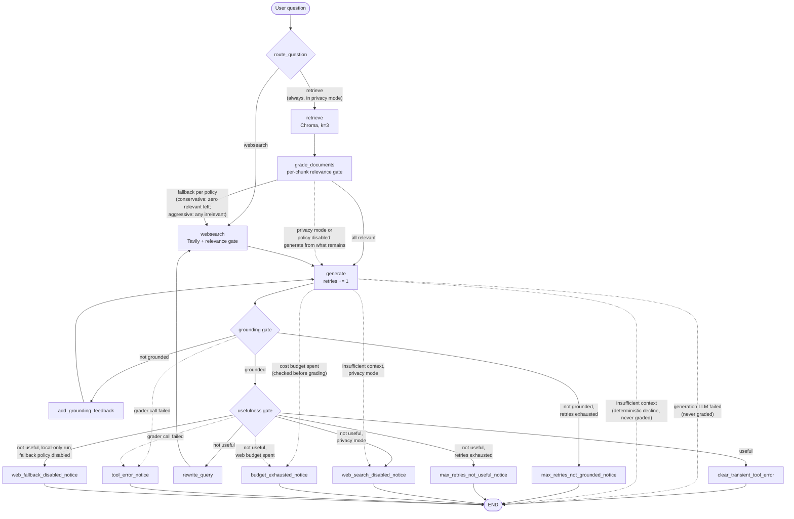

# Enterprise RAG Architecture

This is the architecture deep-dive for the **`enterprise_rag`** module — the
Enterprise Document Q&A engine — with a companion section on the **`office_agent`**
module at the end. The repository now has **two implemented modules**:
`enterprise_rag/` (the RAG engine described in detail below) and `office_agent/`
(the Enterprise Office Agent; see [The Office Agent module](#the-office-agent-module)).
The repo-level [README](README.md) covers
the module layout and quickstart, the module's [README](enterprise_rag/README.md)
covers setup and usage, and this document describes the engine's full workflow,
state machine, and design decisions, including the paths the READMEs' simplified
diagrams omit (terminal notice nodes and retry helpers). The *rationale* behind
the major decisions — context, trade-offs, and rejected alternatives — lives in
the Architecture Decision Records under [docs/adr/](docs/adr/README.md).

## Repository context and module boundaries

The repository is organized as named capability modules (see
[ADR 014](docs/adr/014-enterprise-rag-package-and-office-agent-placeholder.md)):

- **`enterprise_rag/`** — the completed Enterprise Document Q&A / RAG engine that
  the rest of this document describes. All engine code lives here
  (`enterprise_rag/graph/…`, `enterprise_rag/ingestion.py`,
  `enterprise_rag/data/…`); its public entry point is
  `enterprise_rag.graph.engine.answer_question()`.
- **`office_agent/`** — the implemented **Enterprise Office Agent** (through
  v1.6 / Phase 7: seven capabilities). A deterministic, LLM-free intent router
  over local capabilities; public entry point
  `office_agent.engine.answer_office_request()`. It is documented in
  [The Office Agent module](#the-office-agent-module) at the end of this file, and
  must not change or regress `enterprise_rag` behavior or its tests.

**Module boundary (why the two modules stay decoupled):**

- **`enterprise_rag/` owns all RAG behavior** — retrieval, grading, generation,
  the LangGraph state machine, prompts, and provenance. Nothing outside
  `enterprise_rag/` reimplements any of it.
- **`office_agent/` owns deterministic office-workflow routing and tools** — a
  keyword router plus one tool per intent. It is **not** a LangGraph graph; it is
  a thin keyword router + tool dispatch.
- **`office_agent` must not duplicate `enterprise_rag` internals.** The only
  crossing point is the **Knowledge Q&A adapter** (`office_agent/tools/knowledge.py`),
  which calls `enterprise_rag.graph.engine.answer_question()` and reuses its
  formatting; it does not reimplement retrieval, generation, or graph logic.
- **The mock Office Agent tools are local-only, deterministic, CI-safe, and
  read-only by default.** They read `office_agent/mock_data/` lazily, anchor
  dates to the data (not the system clock), and never contact an external
  service. **Simulated actions** (task creation, approve/reject) are computed in
  the response and **must not mutate the repo mock data** — the only write path is
  an explicit persistence *seam* (`record_decision(..., persist_path=...)`) used
  by tests against a caller-provided path (e.g. pytest's `tmp_path`).
- **Tests do not call external services.** The `tests/office_agent/` suite is
  fully mocked/deterministic (the Knowledge adapter is patched), and the
  `enterprise_rag` mocked suites patch every lazy client seam.
- The dedicated Office Agent demo / usage doc is
  [`docs/office-agent-v1-demo.md`](docs/office-agent-v1-demo.md).
- **Repo root** — `main.py` (thin CLI over the engine), `tests/`, `evals/`, and
  `docs/adr/` are repository-level. Root docs
  (`README.md`, `CLAUDE.md`, `structure.md`, `docs/adr/`) stay repo-level;
  module-specific usage lives in `enterprise_rag/README.md` and
  `docs/office-agent-v1-demo.md`.

The numbered sections below (§1–§15) describe the `enterprise_rag` engine itself;
the Office Agent module is documented in its own section at the end.

## 1. Goal

An enterprise internal-document Q&A assistant that **never presents an
unvetted answer as a success**. Built as a self-correcting (CRAG-style)
LangGraph workflow:

- Answers come from a curated local knowledge base (Chroma) — a synthetic
  AcmeCorp internal-document corpus under `enterprise_rag/data/acmecorp_internal_docs/`
  (six fictional policy/guide documents; no real company data) — with web
  search (Tavily) as a fallback, and a privacy mode that disables web
  search entirely.
- Every answer passes explicit quality gates (document relevance, answer
  grounding, answer usefulness).
- Failed gates trigger **meaningful retries** that change the input between
  attempts, bounded by a retry budget.
- Runs that cannot end with a passing answer record a machine-readable
  `stop_reason`, and the CLI attaches an explicit user-facing caveat.
- External dependency failures (retriever, web search, generation LLM,
  graders, query rewriter) never crash the graph: they degrade or stop
  safely with their own `stop_reason` values (see §13).

## 2. High-level architecture

Three layers, all external clients behind lazy `@lru_cache` factories so every
module imports side-effect-free (no API keys, no network at import time):

| Layer | Location | Contents |
|---|---|---|
| Orchestration | `enterprise_rag/graph/graph.py` | `StateGraph` assembly, pure routing functions, `MAX_RETRIES = 5`, compiled `app` |
| Nodes | `enterprise_rag/graph/nodes/` | State-transforming steps; the only place state is written |
| Chains | `enterprise_rag/graph/chains/` | Six LCEL chains on `gpt-5-mini` (`temperature=0`): `question_router`, `retrieval_grader`, `generation`, `hallucination_grader`, `answer_grader`, `query_rewriter` |

Supporting modules: `enterprise_rag/graph/state.py` (the state schema), `enterprise_rag/graph/consts.py`
(node names, `stop_reason` values, the `WEB_SEARCH_SOURCE` metadata marker),
`enterprise_rag/graph/config.py` (env-driven flags), `enterprise_rag/graph/engine.py` (the canonical
programmatic entry point: `answer_question()` / `AnswerOptions` /
`AnswerResult`, plus `seed_state()` — the single state-seeding helper used by
the CLI, the eval harness, and tests — and the lightweight per-run
observability: `run_id`, executed node path, per-step timings, total
duration, and an optional metadata-only trace JSON via
`AnswerOptions.trace_path`; collected centrally by streaming the compiled
graph's node updates (`stream_mode="updates"`), merged onto the seeded state
— GraphState has only last-value channels, so this reproduces `invoke()`
exactly and tracing can never change behavior), `enterprise_rag/graph/formatting.py` (shared
presentation: stop-reason caveats + Sources section), `enterprise_rag/ingestion.py`
(offline, idempotent Chroma build of the local Markdown corpus: collection
reset + deterministic chunk ids, provenance metadata per document),
`main.py` (thin CLI over the engine).

**Design grammar** (applied consistently):
- Conditional edge functions are **pure** — they read state and chains, never write.
- All state writes happen in **nodes**, including tiny pass-through nodes whose
  only job is one write (feedback, rewritten query, stop reason).
- Every retry cycle passes through `generate`, which increments the `retries`
  counter that `MAX_RETRIES` caps.
- Shared string constants live in `consts.py`; user-facing presentation lives
  in `enterprise_rag/graph/formatting.py` (re-exported by `main.py` for backward
  compatibility).

## 3. GraphState

Defined in `enterprise_rag/graph/state.py` (`TypedDict`). `enterprise_rag/graph/engine.py` (`seed_state()`)
seeds every field per question — the single seeding site shared by the CLI,
the eval harness, and tests; all readers use safe defaults so partial states
behave like today's defaults.

| Field | Type | Purpose |
|---|---|---|
| `question` | `str` | The original user question. Never rewritten; all grading judges against it. |
| `documents` | `List[Document]` | Working context: filtered Chroma chunks + at most one web supplement. |
| `generation` | `str` | The latest generated answer. |
| `web_search` | `bool` | Set by `grade_documents` when any retrieved chunk was irrelevant → fall back to web search. |
| `web_search_enabled` | `bool` | Privacy toggle, seeded from `WEB_SEARCH_ENABLED` (or a per-run engine option). `False` = never call external search. |
| `web_fallback_policy` | `str` | Resolved per-run fallback policy (`conservative` / `aggressive` / `disabled`), seeded once by the engine from `WEB_FALLBACK_POLICY` or a per-run option; graph decisions read it from state, never from `os.environ` mid-run. |
| `retries` | `int` | Number of generations so far; caps the quality-check loops. |
| `stop_reason` | `str` | Why the run ended early (`""` = normal finish); drives user-facing caveats. |
| `insufficient_context` | `bool` | Set by `generate` when the latest generation is the deterministic insufficient-context answer (no usable documents); `grade_generation` then skips the graders, which have nothing to verify. |
| `retry_feedback` | `str` | Corrective instruction for the next generation after a failed grounding check (`""` = none). |
| `search_query` | `str` | Rewritten web-search query for retry rounds (`""` = use the original question). |
| `llm_call_count` | `int` | Tracked LLM calls this run (generations, query rewrites, web-result grades). A budgeted operational counter, not total LLM usage — router and grader calls are not individually tracked (see §12). |
| `web_search_count` | `int` | Tavily searches this run. |
| `web_result_grading_count` | `int` | Individual web results sent to the relevance grader this run. |

## 4. Nodes

| Node | Constant | Responsibility |
|---|---|---|
| `retrieve` | `RETRIEVE` | Top-3 similarity search against the persisted Chroma collection. |
| `grade_documents` | `GRADE_DOCUMENTS` | Grade each chunk (`retrieval_grader`); keep relevant ones, set `web_search=True` if any failed. |
| `websearch` | `WEBSEARCH` | Tavily search (`langchain-tavily`) + relevance gate on results (see §7); appends/replaces the web supplement, recording each contributing page's title/URL in `web_sources` metadata. |
| `generate` | `GENERATE` | Generate the answer from question + documents (+ `retry_feedback`); increments `retries`. Empty context → deterministic insufficient-context answer, no LLM call, `insufficient_context=True` (skips the graders downstream). |
| `add_grounding_feedback` | `ADD_GROUNDING_FEEDBACK` | Pass-through: writes the corrective instruction into `retry_feedback`. |
| `rewrite_query` | `REWRITE_QUERY` | Pass-through: rewrites the question into a more specific search query (`query_rewriter` chain) using the previous not-useful answer; writes `search_query`. |
| `web_search_disabled_notice` | `WEB_SEARCH_DISABLED_NOTICE` | Terminal: records `stop_reason = "web_search_disabled"`. |
| `web_fallback_disabled_notice` | `WEB_FALLBACK_DISABLED_NOTICE` | Terminal: records `stop_reason = "web_fallback_disabled"` (`WEB_FALLBACK_POLICY=disabled` blocked a local-only run's not-useful web retry). |
| `max_retries_not_grounded_notice` | `MAX_RETRIES_NOT_GROUNDED_NOTICE` | Terminal: records `stop_reason = "max_retries_not_grounded"`. |
| `max_retries_not_useful_notice` | `MAX_RETRIES_NOT_USEFUL_NOTICE` | Terminal: records `stop_reason = "max_retries_not_useful"`. |
| `budget_exhausted_notice` | `BUDGET_EXHAUSTED_NOTICE` | Terminal: records `stop_reason = "budget_exhausted"`. |
| `tool_error_notice` | `TOOL_ERROR_NOTICE` | Terminal: records `stop_reason = "tool_error"` (a grader call failed; the answer is delivered explicitly unverified). |
| `clear_transient_tool_error` | `CLEAR_TRANSIENT_TOOL_ERROR` | Terminal pass-through on the successful path: clears a stale *transient* `tool_error` once the answer has passed both gates (see §10); other reasons pass through untouched. |

## 5. Conditional routing

Three pure decision functions in `enterprise_rag/graph/graph.py`:

**`route_question`** (conditional entry point)
- Privacy mode off → an LLM router picks `retrieve` (knowledge-base topics) or
  `websearch` (current/external information).
- Privacy mode on → always `retrieve`, **without calling the router LLM** (the
  question never leaves the local environment, and the call is saved).
- Router LLM failure → **falls back to `retrieve`** (the safe, local-first
  default), so a router timeout / auth / quota / network / parse error degrades
  to local retrieval instead of crashing the graph. Because this is a *pure*
  conditional edge, it cannot write state, so no `stop_reason` is recorded for a
  router failure — the run continues through the normal quality gates (see §13).

**`decide_to_generate`** (after document grading)
- All chunks relevant → `generate`.
- Any chunk irrelevant (or retrieval failed) → privacy mode wins first:
  with `web_search_enabled=False`, `generate` proceeds with whatever relevant
  chunks remain (possibly none → the deterministic insufficient-context
  answer). Otherwise the per-run policy in `state["web_fallback_policy"]`
  (seeded from `WEB_FALLBACK_POLICY` or a per-run engine option; see ADR 011)
  decides:
  - `conservative` (default): `generate` when at least one relevant chunk
    remains; `websearch` only with zero relevant chunks left.
  - `aggressive` (legacy): always `websearch`.
  - `disabled`: always `generate` — local retrieval paths never escalate to
    the web.

**`grade_generation`** (after generation; eleven explicit outcomes, each
mapped one-to-one to an edge)

| Outcome | Condition | Next |
|---|---|---|
| `insufficient_context` | the generation is the deterministic insufficient-context answer (no usable documents) — nothing to verify, nothing to improve; the graders are skipped | `END` (privacy mode with no earlier `stop_reason`: `web_search_disabled` notice → `END`, so the caveat explains the limitation) |
| `useful` | grounded + answers the question | `clear_transient_tool_error` → `END` (clears a stale transient `tool_error`; see §10) |
| `not_grounded` | failed grounding, retries remain | `add_grounding_feedback` → `generate` |
| `not_useful` | grounded but off-target, web search enabled, retries remain | `rewrite_query` → `websearch` → `generate` |
| `web_search_disabled` | grounded but off-target, privacy mode | notice node → `END` |
| `web_fallback_disabled` | grounded but off-target on a local-only run (`web_search_count == 0`) with `WEB_FALLBACK_POLICY=disabled` | notice node → `END` |
| `max_retries_not_grounded` | failed grounding at the retry limit | notice node → `END` |
| `max_retries_not_useful` | grounded but off-target at the retry limit | notice node → `END` |
| `budget_exhausted` | per-run cost budget spent (LLM-call budget, checked before grading; or web-search budget when another search round would be needed) | notice node → `END` |
| `generation_error` | the generation LLM call itself failed (the generate node recorded the stop reason and a safe placeholder answer) | `END` directly, never graded |
| `tool_error` | a hallucination/answer grader call failed — the answer cannot be verified | notice node → `END` |

Ordering details that matter:
- A **`generation_error` is checked before everything else** — a failed
  generation must never be graded, retried, or presented as a normal answer.
- The **insufficient-context bypass is checked next, before the budget** — a
  clean honest decline must not be tagged `budget_exhausted`, and an earlier,
  more specific `stop_reason` (e.g. `retrieval_error`) survives because the
  bypass routes straight to `END` instead of through a notice node.
- The **LLM-call budget is checked first among the grading paths, before the
  graders run** — a spent budget must not spend more, so the final answer
  goes out ungraded with a caveat saying exactly that.
- Otherwise, **grade first, then check the retry limit** — even the final
  allowed generation is fully graded; the cap only fires when the answer would
  otherwise loop.
- In the not-useful branch the order is **privacy → fallback policy → retry
  limit → web-search budget**: with web search disabled (or the fallback
  policy forbidding a local run's escalation), improvement was impossible
  regardless of retries, so those caveats are the accurate ones; the web
  budget stops the loop when another (unaffordable) search round would be
  required.

## 6. Full workflow

Step by step:

1. **`route_question`** — vector store vs. web search (or forced retrieval in privacy mode).
2. **`retrieve`** — top-3 Chroma chunks.
3. **`grade_documents`** — per-chunk relevance grading; irrelevant chunks dropped; any failure flags a web-search fallback.
4. **`websearch`** — searches with `search_query` if a retry rewrote it, otherwise the original question. Results are defensively parsed (string error responses, malformed entries, and empty contents are skipped), then **each result is graded for relevance against the original question** — the same gate internal chunks face. Relevant contents merge into one `Document(metadata={"source": "web_search"})` whose `web_sources` metadata lists each contributing page's title/URL (page-level provenance), and which **replaces** any previous web supplement rather than stacking duplicates. Nothing usable → documents pass through unchanged.
5. **`generate`** — strict answer-from-context-only generation; `retry_feedback`, when present, is folded into the question input so a retry differs from the previous attempt. Empty context short-circuits to a fixed insufficient-context answer without calling the LLM.
6. **Grounding check** (`hallucination_grader`) — is every claim supported by the documents?
7. **Usefulness check** (`answer_grader`) — does the grounded answer actually address the question?
8. Failure routing per the table in §5.

## 7. Web-result relevance checking

External web content is the least trusted input in the system, so it does not
bypass the relevance gate that curated chunks pass through. Inside the
`websearch` node (no extra graph edges — keeping the check local avoids
creating a new, ungoverned loop):

- Each Tavily result is graded individually with the existing
  `retrieval_grader` against the **original** question (the intent), even when
  the search itself used a rewritten query.
- Irrelevant results are dropped; only relevant content reaches generation.
- Malformed responses (Tavily errors arrive as plain strings; entries can lack
  `content`) are skipped defensively — the node never crashes, and a fully
  unusable response simply leaves the documents unchanged.

Note that this gate checks **topical relevance, not safety**: an on-topic web
page can still carry prompt-injection text ("ignore previous instructions",
"reveal secrets", …) and pass the gate correctly. The generation prompt
therefore explicitly treats all retrieved context as untrusted evidence,
never as instructions — a first-line, prompt-level defense documented in
[ADR 010](docs/adr/010-prompt-injection-defense.md).

## 8. Meaningful retries

A retry is only worth its cost if something changes between attempts —
re-invoking the same chain with identical inputs at `temperature=0` mostly
reproduces the same failure. Two mechanisms guarantee a difference:

- **`not_grounded` → `add_grounding_feedback` → `generate`**: the next
  generation receives a corrective instruction ("use only explicitly supported
  facts; if the documents are insufficient, say so") folded into its input.
  The prompt template and chain input variables are unchanged.
- **`not_useful` → `rewrite_query` → `websearch` → `generate`**: the
  `query_rewriter` chain produces a more specific search query, informed by
  the previous (not useful) answer. The fresh web supplement replaces the
  stale one, so the next grounding check judges against genuinely new context.

Both helper nodes are linear pass-throughs spliced into the two pre-existing
cycles — no new decision points, so no new uncontrolled loops. Note that
`retry_feedback` persists for the remainder of the run once set: every later
generation in that run keeps the stricter instruction.

## 9. Privacy mode (`WEB_SEARCH_ENABLED=false`)

For deployments where user questions must never reach an external search
service. Parsed by `enterprise_rag/graph/config.py` (`false`/`0`/`no`/`off`, case-insensitive,
disable; anything else — including unset — preserves full behavior) and seeded
into state by `enterprise_rag/graph/engine.py` (`seed_state()`; a per-run `AnswerOptions`
value wins over the environment). When disabled:

- `route_question` always returns `retrieve` and skips the router LLM.
- `decide_to_generate` never falls back to web search; generation proceeds
  with the remaining relevant chunks (or the insufficient-context answer).
- `grade_generation` ends a grounded-but-not-useful run via the
  `web_search_disabled` notice instead of searching; the `rewrite_query` chain
  is never invoked. The deterministic insufficient-context answer ends the
  same way (without grading), unless an earlier, more specific `stop_reason`
  is already recorded.
- The `websearch` node is unreachable (verified by end-to-end tests asserting
  zero web-tool calls in worst-case scenarios).

All grounding and usefulness gates remain active in privacy mode, with one
principled exception in both modes: the deterministic insufficient-context
answer skips the graders — it contains no claims to verify, and regenerating
from the same empty context cannot improve it (see §5).

### Input redaction boundary

Separately from web-search privacy, `answer_question()` performs **best-effort
secret redaction** on the incoming question *before* it seeds state, so
secret-like values do not reach the retriever, router, graders, generator, or
the outbound web-search query (`enterprise_rag/graph/engine.py`). This is an
`answer_question()`-level guarantee: **`seed_state()` does not independently
redact input**, so calling `app.invoke(seed_state(question))` directly bypasses
it. Supported application callers (the CLI, the eval harness, and the Office
Agent knowledge adapter) always go through `answer_question()`; new callers
should too.

### LangSmith tracing (privacy caveat)

Enabling LangSmith tracing (`LANGCHAIN_TRACING_V2=true`; see `.env.example`)
sends prompts, user questions, retrieved document content, intermediate chain
data, and model outputs to an external service (LangSmith). It is **independent
of `WEB_SEARCH_ENABLED` and is not disabled by privacy mode** — leave it
disabled in privacy-sensitive deployments.

## 10. stop_reason and user-facing caveats

Terminal notice nodes record *why* a run ended without a passing answer;
`enterprise_rag/graph/formatting.py` maps each reason to a caveat appended after the answer
(`STOP_REASON_NOTES`; `main.py` re-exports the names). Successful answers are
printed without any caveat, in both modes.

| `stop_reason` | Meaning | User-facing caveat (summary) |
|---|---|---|
| `""` | Both gates passed | none |
| `web_search_disabled` | Grounded but off-target; web search unavailable | "Web search is disabled… answer limited to the local knowledge base." |
| `web_fallback_disabled` | Grounded but off-target; `WEB_FALLBACK_POLICY=disabled` forbids escalating a local-only run to the web | "Web fallback is disabled by policy… answered only from the local knowledge base." |
| `max_retries_not_grounded` | Retry limit hit; answer still failed grounding | "Did not pass the anti-hallucination check… do not treat as fully reliable." |
| `max_retries_not_useful` | Retry limit hit; grounded but still off-target | "Grounded but may not fully answer your question." |
| `budget_exhausted` | Per-run cost budget spent before the gates passed | "Stopped because the per-run cost/latency budget was reached… may be incomplete or not fully verified." |
| `retrieval_error` | Chroma / retriever failed; run degraded (web fallback or insufficient-context answer) | "Local document retrieval failed… answer may be incomplete or unavailable." |
| `web_search_error` | Tavily search failed; run continued with local documents only | "Web search failed, so I answered only from the local knowledge base…" |
| `generation_error` | The generation LLM call failed; a safe placeholder answer was returned, never graded | "The language model call failed before a reliable answer could be generated." |
| `tool_error` | A grader or the query rewriter failed; content was dropped ungraded or verification was skipped | "An internal step failed… answer may be incomplete or not fully verified." |

Degraded-run reasons persist to the end of the run with one deliberate
exception: a **transient `tool_error`** written by a mid-run node (a dropped
chunk/result, a failed query rewrite — situations the run recovers from) is
cleared by the `clear_transient_tool_error` pass-through when the final
answer passes both quality gates, so a fully successful answer never carries
an error caveat. Whole-source degradations (`retrieval_error`,
`web_search_error`) persist even on success — an entire evidence source was
unavailable, which the user should see — and the terminal `tool_error`
(verification itself failed, recorded by `tool_error_notice`) always ends the
run flagged. This persistence is enforced at the write site: a mid-run node
records a **transient** `tool_error` (`grade_documents`, `websearch`,
`rewrite_query`) **only when no earlier `stop_reason` is already set**, so a
later transient failure can never overwrite a persistent whole-source reason
(and therefore can never be cleared away by the success-path cleanup, which
only clears `tool_error`). Terminal notice nodes are unaffected — they still
deliberately write their final reason when a later failure ends the run, so
the reason that actually stopped the run wins. Nodes otherwise only write
`stop_reason` on failure, so a successful step never clobbers an earlier
recorded reason (the success-path cleanup node is the one deliberate
exception).

### Answer provenance (Sources section)

After the caveat (if any), the CLI appends a deterministic `Sources:`
section built by `format_sources(result["documents"])` (`enterprise_rag/graph/formatting.py`)
— pure post-run formatting of `Document` metadata, never an LLM call, never
document content (the engine exposes the same lines as
`AnswerResult.sources`):

- **Local corpus documents** (anything not marked as the web supplement) are
  cited as `- Local corpus: <title>` (falling back to the `source` path, then
  to the safe label `Local corpus document`). Titles come from each corpus
  document's H1 heading; `enterprise_rag/ingestion.py` also records `source` (repo-relative
  path), `source_type: "local_corpus"`, and a `document_category`, all
  persisted through chunking into Chroma.
- **The web supplement** is detected via `metadata["source"] ==
  WEB_SEARCH_SOURCE` (a constant in `consts.py` shared with the `websearch`
  node, which also records `source_type: "web"`, the `search_query` that
  produced the supplement, and `web_sources` — one `{"title", "url"}` entry
  per relevant result with a usable URL, deduplicated by URL). Citation is
  page-level when URLs are known: `- Web search: <title> — <url>` per page
  (bare URL when the title is missing); the fallback chain is the
  query-level `- Web search: "<query>"`, then `Web search result`. Only
  results that passed the relevance gate are cited.
- Duplicate lines are collapsed order-preservingly (several chunks of one
  page cite it once); an empty document list produces no section at all.
- Caveat ordering: the stop-reason caveat is printed *before* the sources,
  so a sources list next to an error never implies the answer was verified.

## 11. Retry exhaustion

`MAX_RETRIES = 5` caps total generations per question. Because the limit is
checked **after** grading, the fifth generation still gets the full two-gate
check — the protective stop only replaces a sixth loop iteration. The two
exhaustion outcomes are distinguished (`max_retries_not_grounded` vs.
`max_retries_not_useful`) because they require different user warnings: the
former may contain unsupported content; the latter is grounded but incomplete.

## 12. Per-run cost / latency budget

Three counters in state track spend; three env-configurable budgets
(`enterprise_rag/graph/config.py`) cap it. Increments happen only in nodes (where state
writes are legal); checks are pure reads:

| Budget (env var) | Default | Counts | Checked where | On exhaustion |
|---|---|---|---|---|
| `MAX_LLM_CALLS_PER_RUN` | 30 | generations (not the empty-context short-circuit), query rewrites, web-result grades | top of `grade_generation`, **before** the graders run | `budget_exhausted` → notice → `END` |
| `MAX_WEB_SEARCHES_PER_RUN` | 5 | actual Tavily calls | `grade_generation` not-useful branch (stops pointless loops) + a defensive guard inside `websearch` (skips the search, documents unchanged) | `budget_exhausted` / skip |
| `MAX_WEB_RESULTS_TO_GRADE` | 15 | individual results sent to the relevance grader | inside `websearch`'s grading loop | remaining results dropped ungraded and unused; run continues |

Deliberate accounting tradeoff: hallucination/answer-grader calls run inside a
conditional *edge* (which cannot write state) and are bounded at two per
generation, so they are not individually counted — capping counted calls
transitively caps them. `grade_documents`' per-chunk grades (≤ k = 3, once per
run, outside every loop) and the router call are likewise uncounted. In other
words, **`llm_call_count` is a tracked operational counter, not total LLM
usage**: it understates real API calls by a bounded factor — adequate as a
budget backstop and for relative observability (the eval report labels it
"tracked LLM calls"), inadequate for billing. True cost accounting would use
tracing/token usage rather than manual counters. Defaults sit above the worst
case the `MAX_RETRIES` loop can produce, so the budgets never bind unless
explicitly tightened; invalid or non-positive env values fall back to the
defaults so a budget can never be accidentally disabled.

## 13. External dependency failure handling

Every external call is wrapped in a `try/except Exception` at its existing
seam. The design rules:

- **Failures in nodes write `stop_reason` directly** (nodes are the only
  legal state writers). Failures inside a pure conditional edge cannot write
  state: `grade_generation` returns a dedicated outcome routed to the
  `tool_error_notice` node instead, and `route_question` falls back to
  `retrieve` **without** recording a `stop_reason` (a router failure therefore
  produces no caveat — the run simply degrades to local retrieval).
- **Unexpected internal / programmer errors may still propagate
  (`answer_question()` exception contract).** The guarantee above covers the
  *expected* external-dependency failures at their wrapped seams — those
  normally return an `AnswerResult` carrying degraded behavior and/or a
  machine-readable `stop_reason`. It is not a total guarantee: a truly
  unexpected error (a bug in a node, a programmer error, any future unwrapped
  seam) is not caught by a top-level catch-all and may surface from
  `answer_question()`, which therefore does **not** promise an `AnswerResult`
  for every possible exception. There is intentionally no blanket `try/except`
  around the whole run, so callers that require process isolation or an
  always-structured API response must add their own exception handling at the
  integration boundary.
- **Console banners log only the exception type** (e.g.
  `---WEB SEARCH FAILED (TimeoutError): ...---`) — never the message, which
  could carry secrets, keys, or paths.
- **Ungraded content is never trusted**: a relevance-grader failure drops the
  affected chunk/result; a hallucination/answer-grader failure ends the run
  with the answer explicitly flagged unverified.
- **Failed attempts still count against budgets** (a failed Tavily call
  increments `web_search_count`; failed LLM calls increment
  `llm_call_count`), so a persistently failing dependency cannot drive an
  unbounded retry loop.

Per dependency:

| Failure | Reaction | Continues? |
|---|---|---|
| Question router (`route_question`) | Fall back to `retrieve` (local-first); pure edge, so no `stop_reason` and no caveat | yes |
| Retriever / Chroma (`retrieve`) | Empty documents + `web_search=True` → degrade to web fallback (privacy mode: deterministic insufficient-context answer); `grade_documents` preserves the incoming flag | yes |
| Tavily (`websearch`) | Local documents only (stale web supplement already dropped); attempt budgeted | yes |
| Generation LLM (`generate`) | Safe placeholder answer + `generation_error`; `grade_generation` routes straight to `END` — never graded | no |
| Query rewriter (`rewrite_query`) | `search_query=""` → next search uses the original question; loop stays fully gated | yes |
| Retrieval grader (`grade_documents` / `websearch`) | Ungraded chunk/result dropped; remaining items still graded; web fallback requested for dropped local chunks | yes |
| Hallucination / answer grader (`grade_generation`) | `tool_error` → notice node → `END`; answer delivered explicitly unverified | no |

All privacy-mode guarantees hold on every failure path (a retrieval failure
in privacy mode still never calls the router, Tavily, or the rewriter).

## 14. Testing overview

| Suite | What it covers | External calls |
|---|---|---|
| `tests/node/` | Each node's state in/out behavior, the web-result relevance gate, defensive Tavily parsing, and graceful degradation when each node's external dependency raises | None — every dependency mocked at its lazy `get_*()` factory seam |
| `tests/graph/` | The three routing functions (every branch incl. defaults), privacy toggle, stop reasons, budget limits and counters, caveat formatting, external-failure degradation (incl. failed-generation-is-never-graded), and compiled-graph end-to-end runs that drive real retry loops to exhaustion and assert negative guarantees (no router / web / rewriter calls in privacy mode; no spend past a budget) | None — fully mocked |
| `tests/chains/` | The six LCEL chains against the real `gpt-5-mini` (prompt + structured-output behavior) | **Real OpenAI API** — gated by the `requires_openai` marker; do not run without explicit approval |
| `tests/evals/` | The eval harness's pure helpers: dataset loading/validation (incl. the shipped dataset), per-row checks, metrics, report rendering | None — pure functions |

Separate from the test suites, `evals/` holds a **behavioral eval harness**:
a 24-question JSONL dataset (local-corpus / web-fallback /
insufficient-context / privacy-mode / multi-document / policy-fallback categories) run through the real compiled
graph by `evals/run_eval.py`, scored with deterministic checks (stop reasons,
source provenance including local title checks, counters including web-search-count expectations, expected substrings, and effective fallback-policy echoes) and reported to
`evals/results.md`. The harness runs each row through
`enterprise_rag.graph.engine.answer_question()` — the same entry point `main.py` uses — so
state seeding is never duplicated; privacy-mode rows pass
`web_search_enabled=False` per run (no env mutation) and hard-assert
`web_search_count == 0`, and rows may optionally pin a per-row
`web_fallback_policy`. The full run needs real API keys and is deliberately
excluded from CI; `--validate-only` checks the dataset with no API calls.

Run the mocked suites with `uv run pytest tests/node/ tests/graph/ tests/evals/ -v`
(no API keys required).

## 15. Known limitations & future improvements

Limitations (deliberate scope):

* Single-turn CLI; no conversation memory or API surface.
* Observability currently has two layers: LangSmith tracing can be enabled via environment variables for full LangChain/LangGraph trace inspection, and the engine records lightweight CI-safe metadata (`run_id`, node path, per-node timings, total duration, counters, stop reasons, and optional trace JSON). However, console logging is still `print()`-based, there is no structured logging or metrics backend, and the documentation does not yet include trace screenshots or trace-link evidence.
* Sequential per-chunk / per-result grading (latency and cost scale with k).
* Grounding feedback is a fixed instruction; the grader returns no rationale about *which* claims were unsupported.
* Prompt-injection defense is prompt-level only (ADR 010): no injection detection, content sanitization, or domain allowlisting; generation has no tools to call, which limits but does not eliminate the impact of injected instructions.

Future improvements (rough priority): structured logging and metrics-friendly observability; README/report evidence for LangSmith traces; grader-scored (LLM-as-judge) metrics on top of the deterministic eval harness; rationale-bearing grounding feedback; batched grading.

GitHub Actions CI (`.github/workflows/ci.yml`) runs two parallel jobs on every push and pull request — both keys-free:

* **`mocked-tests`**: the fully mocked suites (`tests/node/` + `tests/graph/` + `tests/evals/`); the key-gated `tests/chains/` suite and the full eval run are excluded.
* **`lint`**: `ruff check`, `ruff format --check`, and `mypy` (scoped to the engine-API surface: `enterprise_rag/graph/engine.py`, `enterprise_rag/graph/config.py`, `enterprise_rag/graph/formatting.py`, `enterprise_rag/graph/state.py`, `enterprise_rag/graph/consts.py`).

## The Office Agent module

`office_agent/` is the repository's second implemented module: the **Enterprise
Office Agent**, implemented through v1.6 / Phase 7 with seven capabilities (v1 /
Phases 1–5 core tools, the v1.5 / Phase 6 Meeting Agent, and the v1.6 / Phase 7
Workflow / Approval Agent). It is the
office-automation companion to the `enterprise_rag` engine and is intentionally
small, deterministic, and — except for Knowledge Q&A — local and LLM-free. It is
**not** a LangGraph graph; it is a thin keyword router + tool dispatch.

**Design:**

- **Deterministic keyword router** (`office_agent/router.py`) — classifies a
  free-text request into exactly one intent by ordered, case-insensitive keyword
  matching. No LLM is involved, so routing is fast, offline, and reproducible.
  Precedence: `email → workflow_approval → ticket/task → meeting_agent → calendar
  → daily_briefing → knowledge → unknown` (workflow/approval requests — an
  approval keyword or an explicit `APR-<n>` id — are matched before ticket/task,
  so "create a follow-up task for APR-001" is an approval action; meeting-*prep*
  semantics are matched before the broad calendar keywords, so a plain "what
  meetings do I have today?" lookup still routes to `calendar_lookup`).
- **Typed schemas + intent constants** (`office_agent/schemas.py`) — plain
  dataclasses (`OfficeRequest`, `RoutedIntent`, `ToolResult`,
  `OfficeAgentResponse`) plus the `INTENT_*` string constants and the
  `OFFICE_INTENTS` tuple, kept in lockstep with the router and the engine
  dispatch.
- **`ToolResult` contract** — every tool returns a `ToolResult`
  (`tool`, `content`, `stop_reason`, `sources`, `run_id`), so the engine builds a
  uniform `OfficeAgentResponse` with the routed intent attached for
  observability/testing.
- **Entry point** — `office_agent.engine.answer_office_request(user_input: str)
  -> OfficeAgentResponse` routes the request and dispatches to exactly one tool;
  unsupported requests route to `unknown` and return a safe guidance message.
  This is the office-agent analogue of
  `enterprise_rag.graph.engine.answer_question()` — a single, thin dispatch entry
  point, deliberately with no LLM routing.

**Tools** (`office_agent/tools/`):

| Tool | Intent | Data source |
|---|---|---|
| `knowledge.py` | `knowledge_qa` | Thin **adapter** over `enterprise_rag` (the real RAG pipeline) |
| `email.py` | `email_summary` | Local mock `mock_data/emails.json` |
| `calendar.py` | `calendar_lookup` | Local mock `mock_data/calendar_events.json` |
| `tickets.py` | `ticket_assistant` | Local mock `mock_data/tickets.json` + `mock_data/tasks.json` |
| `briefing.py` | `daily_briefing` | Aggregates the email + calendar + ticket mock data |
| `meeting.py` | `meeting_agent` | Composes the calendar + email + ticket/task mock data for one meeting (**v1.5 / Phase 6**) |
| `approvals.py` | `workflow_approval` | Local mock `mock_data/approvals.json` + `mock_data/audit_log.json` (**v1.6 / Phase 7**) |

**`enterprise_rag` is not duplicated inside `office_agent`.** The Knowledge Q&A
tool is a thin *adapter* that calls
`enterprise_rag.graph.engine.answer_question()` and reuses its formatting
(caveats + `Sources:` section); no retrieval, generation, or graph logic is
reimplemented. Knowledge Q&A is the only office tool that reaches an LLM /
external services (through the RAG engine); every other tool is local mock data.

**Local mock data** (`office_agent/mock_data/`) — `emails.json`,
`calendar_events.json`, `tickets.json`, `tasks.json`, `approvals.json`,
`audit_log.json`. It is entirely fictional AcmeCorp data, loaded lazily (imports
stay side-effect-free), treated as **read-only** (task "creation" and approve/
reject decisions are *simulated*, never written back), and
**anchored to the data rather than the system clock** ("today" / "next meeting"
are resolved from the data), so every mock tool is deterministic and CI-safe. No
external service is ever contacted (no Gmail / Outlook / Google Calendar / Slack /
Jira / Linear / Asana / Trello).

**Meeting Agent / Meeting Prep (v1.5 / Phase 6)** is an advanced *composition*
capability. It selects one meeting deterministically ("next", best topic match on
title/labels, or fallback to the next meeting — never the system clock) and
assembles a concise, bounded prep sheet from the local mock data: meeting
metadata, relevant emails, relevant tickets/tasks, inferred knowledge areas, a
suggested agenda, risks/blockers, and recommended follow-ups. It **does not call
the Enterprise RAG pipeline** — "relevant knowledge areas" are inferred from
labels, not retrieved — and it uses no LLM and no external services.

**Workflow / Approval Agent (v1.6 / Phase 7)** is a deterministic mock approval
assistant over the local approval queue (`approvals.json`) and audit log
(`audit_log.json`). It supports list/filter views (all, pending, assigned-to-me,
high-priority, approved, rejected, and topic filters like "expense approvals"),
per-id status, *simulated* approve/reject decisions, *simulated* follow-up task
creation, and audit-log output sorted by timestamp. Simulated actions never
mutate the mock data — `handle_approval_request` writes nothing, and the pure
`build_simulated_decision` / `build_simulated_followup_task` helpers use no system
clock. An optional `record_decision(..., persist_path=...)` seam writes only to a
caller-provided path (tests use `tmp_path`), never the repo mock data. Like the
other mock tools it uses no LLM and contacts no external service.

**Demo & docs.** `scripts/demo_office_agent_v1.py` runs a few requests through
`answer_office_request()` and prints the selected intent + response for each; it
is local-only and deterministic by default (`--include-knowledge` additionally
exercises the real RAG pipeline, which needs the `enterprise_rag` setup and API
keys). Full usage and the capability list are in
[`docs/office-agent-v1-demo.md`](docs/office-agent-v1-demo.md); the architecture
decision behind the module is
[ADR 015](docs/adr/015-office-agent-v1-architecture.md).
